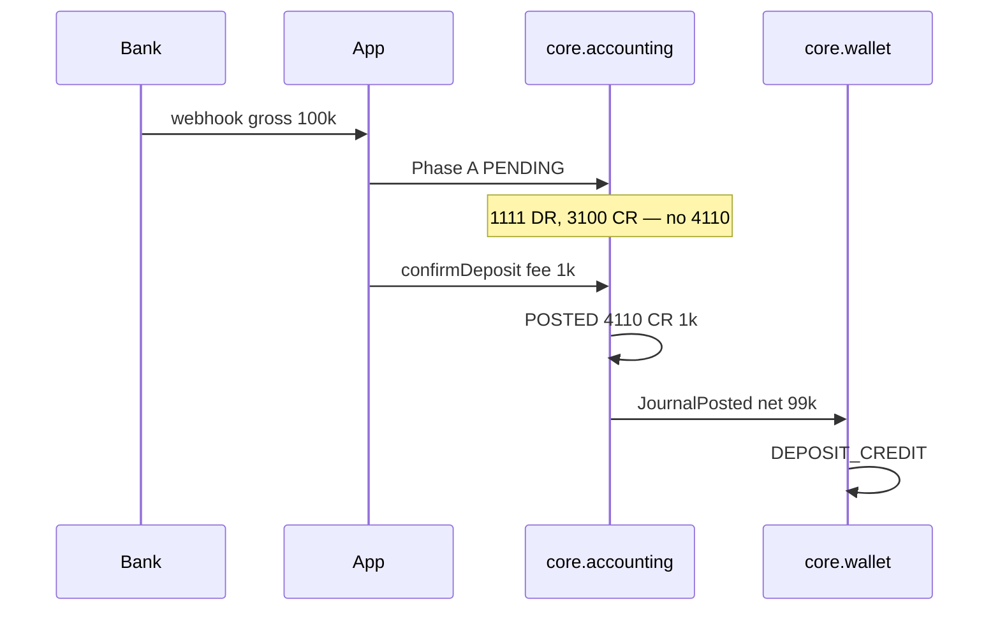

# Quyển I — Nguyên tắc kế toán & khung ledger fintech GtelPay Core

**Trạng thái:** Bản mở rộng (~100 trang in) · **Phạm vi:** `core.accounting` (`coa_*` only) · **Không bao gồm:** `wallet_*`, HTTP public, engine tính phí  
**Đối tượng đọc:** Kế toán nội bộ, kiểm toán, backend, ops, product  
**Số tiền ví dụ chuẩn:** gross **100.000** VND · phí dịch vụ **1.000** VND · chi phí Napas/bank **500** VND · scale **4** HALF_UP ([ADR-028](../../adr/ADR-028-money-scale-four-half-up.md))

COA và DR/CR từng luồng: Quyển II [`vol-02-coa-handbook.md`](./vol-02-coa-handbook.md) + [`foundation.md`](../../spec/foundation.md) §6–16. Contract English: [`accounting.md`](../accounting.md).

---

## Mục lục chi tiết

### Phần A — Khung domain & phương trình

| § | Tiêu đề | Trang ước |
|---|---------|-----------|
| [1](#chương-1-câu-hỏi-domain-accounting-trả-lời) | Câu hỏi domain accounting trả lời | 8 |
| [2](#chương-2-phương-trình-kế-toán-trên-platform) | Phương trình kế toán trên platform | 12 |
| [3](#chương-3-dr-cr-masterclass) | DR/CR masterclass — normal balance, T-account, 25 ví dụ | 35 |

### Phần B — Khung pháp lý & nguyên tắc

| § | Tiêu đề | Trang ước |
|---|---------|-----------|
| [4](#chương-4-luật-kế-toán-2015--điều-3567) | Luật Kế toán 2015 — Điều 3,5,6,7 | 18 |
| [5](#chương-5-mười-nguyên-tắc-gaap--áp-dụng-fintech) | Mười nguyên tắc GAAP — áp dụng fintech | 45 |
| [6](#chương-6-vas-vs-ifrs-vs-platform-ledger) | VAS vs IFRS vs platform ledger | 10 |

### Phần C — Cơ chế ledger platform

| § | Tiêu đề | Trang ước |
|---|---------|-----------|
| [7](#chương-7-accrual-like-ledger-v1--adr-036) | Accrual-like ledger v1 — ADR-036 | 15 |
| [8](#chương-8-immutability--reversal--adr-001) | Immutability & reversal — ADR-001 | 14 |
| [9](#chương-9-triết-lý-tài-khoản-transit-31003820) | Triết lý tài khoản transit 3100–3820 | 16 |
| [10](#chương-10-ghi-nhận-doanh-thu-41104150) | Ghi nhận doanh thu 4110–4150 | 12 |
| [11](#chương-11-matching--chi-phí-5100) | Matching & chi phí 5100 | 10 |

### Phần D — Kiểm soát & vận hành

| § | Tiêu đề | Trang ước |
|---|---------|-----------|
| [12](#chương-12-nguyên-tắc-thận-trọng--20-edge-case) | Nguyên tắc thận trọng — 20 edge case | 14 |
| [13](#chương-13-bản-chất-hơn-hình-thức--15-ví-dụ) | Bản chất hơn hình thức — 15 ví dụ | 12 |
| [14](#chương-14-periodicity--đóng-kỳ-adr-023) | Periodicity & đóng kỳ — ADR-023 | 10 |
| [15](#chương-15-đơn-vị-tiền-tệ-adr-028) | Đơn vị tiền tệ — ADR-028 | 8 |
| [16](#chương-16-idempotency--adr-005) | Idempotency — ADR-005 | 10 |
| [17](#chương-17-ranh-giới-hai-schema--adr-002003) | Ranh giới hai schema — ADR-002/003 | 8 |
| [18](#chương-18-nguyên-tắc-đối-soát-fr-10--w5) | Nguyên tắc đối soát FR-10 & W5 | 10 |
| [19](#chương-19-bằng-chứng-kiểm-toán--explainability) | Bằng chứng kiểm toán & explainability | 8 |

### Phần E — Tham khảo & FAQ

| § | Tiêu đề | Trang ước |
|---|---------|-----------|
| [20](#chương-20-pitfalls-ngành-fintech--30-mục) | Pitfalls ngành fintech — 30 mục | 12 |
| [21](#chương-21-faq--50-câu) | FAQ — 50 câu | 18 |
| [A](#phụ-lục-a--thuật-ngữ) | Phụ lục A — Thuật ngữ | 6 |
| [B](#phụ-lục-b--bảng-tra-adr) | Phụ lục B — Bảng tra ADR | 4 |
| [C](#phụ-lục-c--9-luồng-tóm-tắt-nguyên-tắc) | Phụ lục C — 9 luồng tóm tắt | 6 |
| [Đọc tiếp](#đọc-tiếp) | Liên kết corpus | 2 |

---

## Chương 1. Câu hỏi domain accounting trả lời

### 1.1 Một câu hỏi duy nhất

Accounting (`core.accounting`) trả lời **một** câu hỏi:

> *Sự thật tài chính có cân bằng, có audit trail, phản ánh đúng nghiệp vụ đã xảy ra trên platform là gì?*

Câu hỏi này **khác** câu hỏi của wallet (`core.wallet`):

> *Member này còn bao nhiêu `available` / `frozen` để chi tiêu?*

Hai domain tách cứng theo [`boundaries.md`](../../design/platform/boundaries.md), [ADR-002](../../adr/ADR-002-core-foundation-shared-library.md), [ADR-003](../../adr/ADR-003-dual-schema-single-postgres.md). Orchestration nối hai domain qua event/API — **không** JOIN SQL cross-schema.

### 1.2 Bảng đảm bảo vs không làm

| Accounting **đảm bảo** | Accounting **không làm** |
|------------------------|--------------------------|
| Mỗi journal POSTED: `sum(DR) = sum(CR)` | Lưu số dư chi tiêu được của từng member |
| Transit 3100–3820 = 0 khi luồng kết thúc terminal | `JOIN wallet_*` trong SQL repository |
| Dòng POSTED không UPDATE — sửa = bút toán đảo | Tự tính phí từ rule sản phẩm ([ADR-009](../../adr/ADR-009-fee-ownership-orchestration.md)) |
| `business_ref` idempotent end-to-end ([ADR-005](../../adr/ADR-005-idempotency-key-strategy.md)) | Expose HTTP public (S1) |
| Phát `JournalPosted` sau POSTED (adapter) | Điều chỉnh COA vì wallet lệch (W5 report-only — [ADR-014](../../adr/ADR-014-reconciliation-w5-report-only.md)) |
| Control account 2110/2120/2130 mirror **tổng hợp** theo lane | Per-member sub-ledger trên `coa_*` |
| Period close chặn back-date ([ADR-023](../../adr/ADR-023-accounting-period-close.md)) | Đóng kỳ tự động sửa số đã post |
| Trial balance derive từ `coa_trans_data` POSTED | Authoritative `account_balance` UPDATE thay posting |

### 1.3 Ranh giới với orchestration & Application

```
Member / Bank
      │
      ▼
Application (S1 HTTP, webhook, Kafka)
      │
      ▼
Orchestration ──┬──► core.accounting (coa_*)  ← Quyển I
                └──► core.wallet (wallet_*)   ← ngoài phạm vi
```

| Vai trò | Trách nhiệm kế toán |
|---------|---------------------|
| **Orchestration** | Tính phí một lần; build DR/CR lines; gọi `createJournal` / `postJournal` |
| **core.accounting** | Validate cân; persist immutable; transit zero; period open |
| **core.wallet** | `available` / `frozen` per member — sync **sau** POSTED (deposit) hoặc quanh post (payment) |
| **Ops / Audit** | Đọc ledger; reversal có phê duyệt; W5 recon — không sửa trực tiếp dòng POSTED |

### 1.4 Thuật ngữ journal vs journal entry (bẫy TRD)

| Thuật ngữ platform | Bảng | TRD / API (dễ nhầm) |
|--------------------|------|---------------------|
| **Journal** (bút toán) | `coa_trans` | `journal_entries` (header) |
| **Journal entry** (dòng) | `coa_trans_data` | `journal_lines` |
| Khóa idempotent | `business_ref` | `reference_id` |
| Draft / Posted | `PENDING` / `POSTED` | Draft / Posted |

Chi tiết: [`foundation.md`](../../spec/foundation.md) §2.2, [`TERMINOLOGY.md`](../../TERMINOLOGY.md).

### 1.5 Tại sao ledger fintech cần tài liệu nguyên tắc riêng

Ledger payment platform **không** phải sổ kế toán doanh nghiệp TT200/99 đầy đủ. Tuy nhiên:

1. **Kiểm toán nội bộ** cần map Luật KT 2015 → invariant kỹ thuật.
2. **Backend** cần hiểu *vì sao* PENDING deposit, transit zero, immutable — tránh "sửa nhanh" phá audit.
3. **Ops** cần playbook khi 3100 aging, W5 drift, period close block.
4. **Product** cần biết chỗ `[TBD]` — không bịa fee tier trong code accounting.

Quyển I là **lớp giải thích**; Quyển II–X là **depth từng luồng**.

### 1.6 Checklist onboarding — 10 câu hỏi phải trả lời được

| # | Câu hỏi | Đáp án ngắn |
|---|---------|-------------|
| Q1 | Sửa số đã POSTED? | Không — reversal journal ([ADR-001](../../adr/ADR-001-immutable-ledger.md)) |
| Q2 | Credit wallet khi webhook bank? | Không — chỉ sau POSTED phase B deposit ([ADR-006](../../adr/ADR-006-two-phase-deposit.md)) |
| Q3 | Ai tính phí 1.000 trên gross 100.000? | Orchestration — accounting ghi số nhận ([ADR-009](../../adr/ADR-009-fee-ownership-orchestration.md)) |
| Q4 | 3100 ≠ 0 có bình thường? | Có khi deposit PENDING; không khi POSTED ([ADR-010](../../adr/ADR-010-transit-accounts-net-zero.md)) |
| Q5 | JOIN wallet + accounting? | Cấm ([ADR-003](../../adr/ADR-003-dual-schema-single-postgres.md)) |
| Q6 | Wallet lệch 2110 — ai sửa? | Ops: reversal + adjustment — không auto COA ([ADR-014](../../adr/ADR-014-reconciliation-w5-report-only.md)) |
| Q7 | IBFT ghi 1111 hay 1112? | **1112** Napas Clearing ([ADR-025](../../adr/ADR-025-ibft-napas-clearing-1112.md)) |
| Q8 | Đơn vị tiền? | VND only v1, scale 4 ([ADR-019](../../adr/ADR-019-vnd-single-currency-v1.md), [ADR-028](../../adr/ADR-028-money-scale-four-half-up.md)) |
| Q9 | Cash basis hay accrual? | Accrual-like v1 ([ADR-036](../../adr/ADR-036-accrual-basis-ledger-v1.md)) |
| Q10 | Đóng kỳ khi còn PENDING deposit? | Block hoặc waiver list ([ADR-023](../../adr/ADR-023-accounting-period-close.md)) |

---

## Chương 2. Phương trình kế toán trên platform

### 2.1 Phương trình cơ bản

```
Tài sản = Nợ phải trả + Vốn chủ sở hữu

Assets = Liabilities + Equity
```

Trên GtelPay Core v1, **invariant vận hành hàng ngày** (foundation §5) thu hẹp thành:

```
Tài sản ngân hàng (1111 + 1112 + 1113) = Nợ phải trả ví (2110 + 2120 + 2130)
```

Đây là **Invariant 1** — phải đúng mọi thời điểm sau mỗi journal POSTED hoàn chỉnh.

### 2.2 Bảng COA tham gia invariant 1

| Nhóm | Mã | Tên | Ý nghĩa platform |
|------|-----|-----|------------------|
| Tài sản | 1111 | Vietinbank — dedicated | VA deposit, withdraw payout |
| Tài sản | 1112 | Napas Clearing | IBFT, payroll batch, EOD settlement rail |
| Tài sản | 1113 | VPBank — QR/POS acquirer | Thu từ acquirer trước EOD |
| Nợ | 2110 | Wallet balance — User | Tổng nợ đối với user (lane USER) |
| Nợ | 2120 | Wallet balance — Merchant | Tổng nợ đối với merchant (lane MERCHANT) |
| Nợ | 2130 | Escrow — Disbursement partner | Lane PARTNER — pre-fund disbursement |

**Không có** tài khoản 211x per-member trên ledger. Mirror **tổng hợp**; chi tiết per-member = `wallet_balance` (recon W5, báo cáo — [ADR-014](../../adr/ADR-014-reconciliation-w5-report-only.md), [ADR-020](../../adr/ADR-020-wallet-lanes-coa-control-mapping.md)).

### 2.3 Vốn chủ 6000 — ngoài luồng hàng ngày

| Mã | Vai trò |
|----|---------|
| 6000 | Owner's equity — khởi tạo hệ thống trước go-live |

Khởi tạo (foundation §7):

| Bước | TK | DR/CR | Số tiền |
|------|-----|-------|---------|
| Vốn vào Vietinbank | 1111 DR / 6000 CR | 1.000.000.000 |
| Vốn vào VPBank | 1113 DR / 6000 CR | 500.000.000 |
| Fund Napas | 1112 DR / 6000 CR | 500.000.000 |

Sau go-live, mọi movement user qua deposit — **không** qua 6000. Lợi nhuận tích lũy qua 411x − 5100; báo cáo BCTC công ty là tầng khác (ngoài Quyển I).

### 2.4 Invariant 2 & 3

| # | Invariant | Ý nghĩa |
|---|-----------|---------|
| 2 | Số dư bank thực ≈ tổng quyền user/merchant/partner | Đối soát FR-10; tolerance timing |
| 3 | Mỗi transit 3100–3820 → **0** khi use case terminal POSTED | [ADR-010](../../adr/ADR-010-transit-accounts-net-zero.md) |

### 2.5 Chứng minh invariant 1 — deposit POSTED (ví dụ chuẩn)

**Giả thiết:** gross 100.000, phí 1.000, user nhận net 99.000.

**Trước deposit:** giả sử 1111 = 500.000.000; 2110 = 450.000.000 → cân.

**Sau POSTED (foundation §8.1 tổng hợp):**

| TK | Biến động | Số dư mới (minh họa) |
|----|-----------|----------------------|
| 1111 | +100.000 DR | 500.100.000 |
| 2110 | +99.000 CR (net liability) | 450.099.000 |
| 4110 | +1.000 CR (revenue) | — |

**Kiểm tra:**

```
Δ1111 = +100.000
Δ(2110) = +99.000
Chênh = 100.000 − 99.000 = 1.000 = Δ4110 (revenue không nằm trong invariant 1)
```

Invariant 1 so **bank assets** vs **wallet liabilities** — doanh thu 4110 là **equity ảnh hưởng gián tiếp** qua retained earnings, không nằm trong phương trình vận hành hàng ngày 111x = 211x+212x+213x.

**Công thức đầy đủ mở rộng:**

```
1111 + 1112 + 1113 = 2110 + 2120 + 2130 + (transit net) + [điều chỉnh chưa post]
```

Khi POSTED hoàn chỉnh: transit net = 0.

### 2.6 Chứng minh — payment nội bộ (không bank)

User trả merchant 100.000 qua ví (foundation §13):

| TK | DR | CR |
|----|----|----|
| 2110 | 100.000 | |
| 3500 | | 100.000 |
| 3500 | 100.000 | |
| 2120 | | 100.000 |

```
Δ2110 = −100.000 (DR user liability)
Δ2120 = +100.000 (CR merchant liability)
Δ111x = 0
```

Invariant 1 **giữ nguyên** — đúng: tiền không ra/vào bank, chỉ chuyển nợ nội bộ.

### 2.7 Chứng minh — withdraw POSTED

Gross debit user 101.000 (100.000 + phí 1.000), bank trả 100.000 (foundation §9):

| TK | Biến động net |
|----|---------------|
| 2110 | −101.000 |
| 1111 | −100.000 |
| 4120 | +1.000 |

```
Δ1111 = −100.000
Δ2110 = −101.000
Chênh = 1.000 = fee revenue 4120
```

### 2.8 Phương trình mở rộng có transit (deposit PENDING)

Phase A only:

| TK | DR | CR |
|----|----|----|
| 1111 | 100.000 | |
| 3100 | | 100.000 |

```
1111 +100.000; 3100 CR 100.000 (transit liability nội bộ)
2110 chưa đổi
```

**Lúc này** 1111 ≠ 2110+2120+2130 — **chấp nhận được** vì 100.000 "đang giữ" trên 3100. Invariant 3 chưa đạt; Invariant 1 đạt lại sau POSTED khi 3100 = 0 và 2110 +99.000.

### 2.9 Bảng trạng thái invariant theo phase

| Phase | Invariant 1 | Invariant 3 (3100) | Wallet 2110 mirror |
|-------|-------------|---------------------|-------------------|
| Deposit PENDING A | Có thể lệch tạm | 3100 ≠ 0 | Chưa credit |
| Deposit POSTED B | Đạt | 3100 = 0 | Credit net 99.000 |
| Payment POSTED | Đạt | 3500 = 0 | Debit/credit đồng bộ |
| EOD giữa chừng | Có thể lệch | 3800/3810/3820 ≠ 0 | [TBD: SLA EOD] |

### 2.10 Sai lầm thường gặp khi kiểm tra phương trình

| Sai lầm | Hậu quả | Cách đúng |
|---------|---------|-----------|
| So 2110 với **một** user | Ledger không có per-member | W5: SUM wallet USER vs 2110 |
| Kỳ vọng 1111 = 2110 sau mỗi txn | Bỏ qua 411x, 5100, timing | Dùng công thức mở rộng §2.8 |
| Coi 3100 là tài sản | Hiểu sai bản chất | 3100 = transit, net zero terminal |
| JOIN wallet để "fix" 2110 | Phá bounded context | Hai query + báo cáo W5 |

---


## Chương 3. DR/CR masterclass

### 3.1 Normal balance — quy tắc vàng

| Loại tài khoản | Số dư bình thường | Tăng | Giảm | Ví dụ COA |
|----------------|-------------------|------|------|-----------|
| Tài sản (1xxx) | **Nợ (Debit)** | Ghi Nợ | Ghi Có | 1111, 1112, 1113 |
| Nợ phải trả (2xxx) | **Có (Credit)** | Ghi Có | Ghi Nợ | 2110, 2120, 2130 |
| Transit (31xx–38xx) | **Net zero** tại POSTED | Tạm ≠ 0 in-flight | Phải về 0 | 3100–3820 |
| Doanh thu (411x) | **Có** | Ghi Có | Ghi Nợ (đảo) | 4110–4150 |
| Chi phí (5100) | **Nợ** | Ghi Nợ | Ghi Có (đảo) | 5100 |
| Vốn (6000) | **Có** | Ghi Có | Ghi Nợ | 6000 init only |

**Duality:** mọi `coa_trans` — `sum(DR) = sum(CR)`. Không có bút toán một chiều.

### 3.2 T-account — deposit phase A (PENDING)

```
    1111 Vietinbank          |    3100 Transit Deposit
    (Tài sản - Nợ)          |    (Transit)
─────────────────────────────┼─────────────────────────────
    DR 100.000 (webhook)    |              CR 100.000
                            |
    SD Nợ +100.000          |    SD Có +100.000 (net hold)
```

### 3.3 T-account — deposit phase B (POSTED)

```
    3100                    |    2110 User           |    4110 Deposit fee
─────────────────────────────┼──────────────────────────┼──────────────────
    DR 100.000 (clear)      |         CR 99.000 (net)  |      CR 1.000
                            |    DR 1.000 (fee gross)  |
    SD = 0                  |    SD Có +99.000 net     |   SD Có +1.000
```

### 3.4 Bảng 25 ví dụ DR/CR có lời giải

| # | Tình huống | Dòng chính | Giải thích |
|---|------------|------------|------------|
| E01 | Khởi tạo 1111 | 1111 DR 1 tỷ / 6000 CR 1 tỷ | Vốn vào bank — không user |
| E02 | Deposit A PENDING | 1111 DR 100k / 3100 CR 100k | Tiền vào, chưa nợ user |
| E03 | Deposit B POSTED | 3100 DR 100k / 2110 CR 99k / 2110 DR 1k / 4110 CR 1k | Net user 99k |
| E04 | Deposit zero fee | 3100 DR 100k / 2110 CR 100k | Không dòng 4110 |
| E05 | Reverse PENDING A | 1111 CR 100k / 3100 DR 100k | Chỉ đảo A — không đụng 2110 |
| E06 | Withdraw accept | 2110 DR 101k / 3200 CR 101k | User gross + fee |
| E07 | Withdraw bank | 3200 DR 100k / 1111 CR 100k | Tiền ra bank |
| E08 | Withdraw fee | 3200 DR 1k / 4120 CR 1k | Doanh thu rút |
| E09 | Transfer A→B | 2110 DR 101k / 3300 CR 101k | A trả gross |
| E10 | Transfer credit B | 3300 DR 100k / 2110 CR 100k | B nhận net |
| E11 | Transfer fee | 3300 DR 1k / 4130 CR 1k | Phí chuyển nội bộ |
| E12 | Payment user | 2110 DR 100k / 3500 CR 100k | User trả |
| E13 | Payment merchant | 3500 DR 100k / 2120 CR 100k | Merchant nhận |
| E14 | IBFT freeze+fee | 2110 DR 101k / 3400 CR 101k | Gross user |
| E15 | IBFT fee rev | 3400 DR 1k / 4130 CR 1k | 4130 +1k |
| E16 | IBFT bank | 3400 DR 100k / 1112 CR 100k | Napas rail |
| E17 | IBFT Napas cost | 5100 DR 500 / 1112 CR 500 | Chi phí 500 |
| E18 | QR acquirer in | 1113 DR 100k / 3500 CR 100k | VPBank |
| E19 | QR acquirer fee | 5100 DR 500 / 1113 CR 500 | Cost 500 |
| E20 | QR merchant | 3500 DR 100k / 2120 CR 100k | Pending EOD |
| E21 | Payroll batch | 2120 DR 505k / 3600 CR 505k | 5×100k + fee 5k |
| E22 | Payroll bank | 3600 DR 500k / 1112 CR 500k | Napas out |
| E23 | Disburse pre-fund | 1111 DR 100k / 2130 CR 100k | Partner escrow |
| E24 | EOD lock | 2120 DR 200k / 3800 CR 200k | Giữ settlement |
| E25 | EOD MDR | 3800 DR 2k / 3820 CR 2k / 4140 CR 2k | MDR 1% minh họa |

### 3.5 Ví dụ E03 chi tiết — từng dòng `coa_trans_data`

**Input orchestration:** gross=100.000, fee=1.000, net=99.000, `use_case=DEPOSIT`, `business_ref=bank-txn-abc`.

| line | account_code | DR | CR | Diễn giải |
|------|--------------|----|----|-----------|
| 1 | 3100 | 100.000 | 0 | Clear transit (phase B) |
| 2 | 2110 | 0 | 99.000 | Ghi nợ platform đối user net |
| 3 | 2110 | 1.000 | 0 | Gross-up fee từ user (presentation) |
| 4 | 4110 | 0 | 1.000 | Doanh thu phí nạp |

**Kiểm tra:** DR = 100.000 + 1.000 = 101.000; CR = 99.000 + 1.000 + 1.000 = 101.000 — **cân**.

*Lưu ý presentation:* foundation §8.1 tách bước 4–6; có thể gộp 2110 net một dòng CR 99.000 nếu template cho phép — **tổng vẫn cân**.

### 3.6 Ví dụ E16–E17 — IBFT lãi gộp 500

User trả 101.000; bank chuyển 100.000; phí user 1.000; Napas cost 500:

| Hạng mục | Số tiền |
|----------|---------|
| 4130 CR | +1.000 |
| 5100 DR | +500 |
| **Lãi gộp** | **500** |

Đây là **matching** trong cùng journal POSTED (Chương 11).

### 3.7 DR/CR "cảm giác ngược" — cheat sheet

| Câu hỏi intuitive | Kết quả ledger | Vì sao |
|-------------------|----------------|--------|
| "Tiền vào bank" | 1111 **DR** | Tài sản tăng = Nợ |
| "Nợ user tăng" | 2110 **CR** | Nợ phải trả tăng = Có |
| "Thu phí dịch vụ" | 4110 **CR** | Doanh thu tăng = Có |
| "Trả phí Napas" | 5100 **DR** | Chi phí tăng = Nợ |
| "User rút — giảm nợ" | 2110 **DR** | Giảm liability = Nợ |

### 3.8 Bài tập tự kiểm — đáp án

| Bài | Đề | Đáp án |
|-----|-----|--------|
| B1 | Payment 100k không phí — merchant nhận? | 2120 CR 100.000 |
| B2 | Withdraw 100k + fee 1k — 2110? | DR 101.000 |
| B3 | Transfer A→B fee 1k — 4130? | CR 1.000 |
| B4 | Deposit PENDING — 2110 đổi? | Không |
| B5 | IBFT — TK bank asset? | 1112 CR 100.000 |

### 3.9 Lỗi DR/CR phổ biến trong code review

| Mã lỗi | Mô tả | Phát hiện |
|--------|-------|----------|
| DC-01 | Ghi Có 1111 khi tiền vào | Trial balance bank âm |
| DC-02 | 2110 DR khi deposit credit | Liability giảm sai |
| DC-03 | Quên fee line | DR ≠ CR reject |
| DC-04 | IBFT ghi 1111 | Vi phạm ADR-025 |
| DC-05 | Transit không về 0 | ADR-010 post reject |

### 3.10 Liên kết

DR/CR đầy đủ từng use case: [`foundation.md`](../../spec/foundation.md) §8–16. COA handbook: [`vol-02-coa-handbook.md`](./vol-02-coa-handbook.md).

### 3.11 Ví dụ E06–E08 withdraw — từng bước T-account

**E06 — Accept (user gross 101.000 = 100.000 + fee 1.000):**

```
2110 (Nợ liability)     DR 101.000  ← giảm nợ user (user trả phí + principal)
3200 (Transit)          CR 101.000  ← giữ in-flight
```

**E07 — Bank payout 100.000:**

```
3200                    DR 100.000
1111                    CR 100.000  ← tiền ra Vietinbank
```

**E08 — Fee revenue:**

```
3200                    DR 1.000
4120                    CR 1.000
```

**Kết quả:** 3200 net 0; 2110 −101.000; 1111 −100.000; 4120 +1.000.

### 3.12 Ví dụ E12–E13 payment — không phí

User mua hàng 100.000 từ merchant (wallet payment):

| Bước | DR | CR | Giải thích |
|------|----|----|------------|
| 1 | 2110 100.000 | | Giảm nợ user |
| 2 | | 3500 100.000 | Vào transit |
| 3 | 3500 100.000 | | Ra transit |
| 4 | | 2120 100.000 | Tăng nợ merchant |

Không 111x — internal. Transit 3500 = 0 ngay POSTED.

### 3.13 Ví dụ E14–E17 IBFT — đầy đủ 6 dòng fee+cost

| line | TK | DR | CR |
|------|-----|----|----|
| 1 | 2110 | 101.000 | |
| 2 | 3400 | | 101.000 |
| 3 | 3400 | 1.000 | |
| 4 | 4130 | | 1.000 |
| 5 | 3400 | 100.000 | |
| 6 | 1112 | | 100.000 |
| 7 | 5100 | 500 | |
| 8 | 1112 | | 500 |

### 3.14 Ví dụ E18–E20 QR/POS — acquirer path

Acquirer báo 100.000 vào VPBank; cost 500; merchant credit 2120 pending EOD:

| Chỉ số | Giá trị |
|--------|---------|
| 1113 DR | 100.000 |
| 5100 DR | 500 |
| 1113 CR | 500 |
| 2120 CR | 100.000 |
| 3500 net | 0 |

### 3.15 Ví dụ E21–E22 Payroll — batch 5×100.000

| Chỉ số | Giá trị |
|--------|---------|
| Merchant debit 2120 | 505.000 (500k + fee 5k) |
| 4150 CR | 5.000 |
| 1112 CR | 500.000 |
| 5100 DR | 2.500 |
| 3600 net | 0 |

### 3.16 Ví dụ E24–E25 EOD — merchant 200.000 gross

Lock 200.000; MDR 2.000 (minh họa 1%); net settlement 198.000; Napas fee [TBD]:

| Bước | TK | DR | CR |
|------|-----|----|----|
| Lock | 2120 | 200.000 | |
| | 3800 | | 200.000 |
| MDR | 3800 | 2.000 | |
| | 3820 | | 2.000 |
| | 4140 | | 2.000 |
| Settle | 3810 | 198.000 | |
| | 1112 | | 198.000 + fees |

### 3.17 Bảng đối chiếu normal balance — 15 tài khoản

| Mã | Loại | Normal | Tăng | Giảm |
|----|------|--------|------|------|
| 1111 | TS | Nợ | DR | CR |
| 1112 | TS | Nợ | DR | CR |
| 1113 | TS | Nợ | DR | CR |
| 2110 | Nợ | Có | CR | DR |
| 2120 | Nợ | Có | CR | DR |
| 2130 | Nợ | Có | CR | DR |
| 3100 | Transit | Net 0 | — | — |
| 3200 | Transit | Net 0 | — | — |
| 3300 | Transit | Net 0 | — | — |
| 3400 | Transit | Net 0 | — | — |
| 3500 | Transit | Net 0 | — | — |
| 4110 | DT | Có | CR | DR |
| 5100 | CP | Nợ | DR | CR |
| 6000 | Vốn | Có | CR | DR |
| 3820 | Transit | Net 0 | — | — |

### 3.18 Proof worksheet — deposit full 2-phase

| Phase | 1111 | 3100 | 2110 | 4110 | DR sum | CR sum |
|-------|------|------|------|------|--------|--------|
| A | +100k | +100k CR | 0 | 0 | 100k | 100k |
| B delta | 0 | 0 net | +99k | +1k | 101k | 101k |
| Total | +100k | 0 | +99k | +1k | — | — |

---

## Chương 4. Luật Kế toán 2015 — Điều 3,5,6,7

**Nguồn:** [`vn-luat-ke-toan-2015-dieu-5-7.md`](../../references/vn-luat-ke-toan-2015-dieu-5-7.md) · Phân tích thêm: [`hoiketoanhcm-nguyen-tac-luat-ke-toan-2015.md`](../../references/hoiketoanhcm-nguyen-tac-luat-ke-toan-2015.md)

### 4.1 Điều 3 — Đơn vị tiền tệ

> Đơn vị tiền tệ trong kế toán mặc định là **Đồng Việt Nam (VND)**.

| Khoản Luật | Platform binding |
|------------|------------------|
| VND mặc định | [ADR-019](../../adr/ADR-019-vnd-single-currency-v1.md) — v1 chỉ VND |
| Ngoại tệ (DN đủ điều kiện) | **Out of scope v1** — từ chối journal multi-currency |
| Scale & làm tròn | [ADR-028](../../adr/ADR-028-money-scale-four-half-up.md) — scale 4, HALF_UP tại orchestration |

**Hệ quả kỹ thuật:** mọi `coa_trans_data.amount` là `DECIMAL(19,4)`; OpenAPI wire `"100000.0000"`.

### 4.2 Điều 5 — Yêu cầu kế toán (6 khoản)

#### 4.2.1 Khoản 1 — Phản ánh đầy đủ

| Yêu cầu | Ý nghĩa DN | Binding platform |
|---------|------------|------------------|
| Đầy đủ nghiệp vụ KT, TC | Mọi GD vào chứng từ, sổ, BCTC | Mỗi `use_case` = template DR/CR riêng; không gộp deposit vào payment |
| Không bỏ sót luồng | Audit trail | `coa_trans` + `coa_trans_data` append-only |

**Ví dụ vi phạm:** ghi deposit thành payment vì cùng API `/funds/in` — **sai bản chất** (xem Chương 13).

#### 4.2.2 Khoản 2 — Kịp thời, đúng kỳ

| Yêu cầu | Binding |
|---------|---------|
| Ghi nhận đúng thời điểm | `coa_trans.posted_at` / `posting_date` |
| Không back-date kỳ đóng | [ADR-023](../../adr/ADR-023-accounting-period-close.md) |
| EOD đúng ngày acquirer | [ADR-015](../../adr/ADR-015-eod-settlement-independent-batch.md) batch độc lập |

#### 4.2.3 Khoản 3 — Rõ ràng, chính xác

| Yêu cầu | Binding |
|---------|---------|
| Dễ hiểu | `use_case` enum cố định; COA code có tên |
| Chính xác số | Scale 4; reject DR≠CR |
| Từng dòng minh bạch | `coa_trans_data` per DR/CR |

#### 4.2.4 Khoản 4 — Trung thực, khách quan, bản chất

| Yêu cầu | Binding |
|---------|---------|
| Trung thực | Không sửa POSTED ([ADR-001](../../adr/ADR-001-immutable-ledger.md)) |
| Khách quan | Số từ bank webhook + orchestration — không ý kiến chủ quan |
| **Bản chất** | `use_case` theo nghiệp vụ kinh tế ([ADR-025](../../adr/ADR-025-ibft-napas-clearing-1112.md) IBFT→1112) |

#### 4.2.5 Khoản 5 — Liên tục

| Yêu cầu | Binding |
|---------|---------|
| Liên tục kỳ | Period close nối kỳ; reversal chain `reverses_id` |
| So sánh được | Template nhất quán qua các kỳ |

#### 4.2.6 Khoản 6 — Có hệ thống

| Yêu cầu | Binding |
|---------|---------|
| Phân loại | COA foundation §6 — 6 nhóm |
| Không tự ý thêm TK runtime | [TBD: COA change process] — cần ADR mới |

### 4.3 Điều 6 — Nguyên tắc kế toán (7 khoản)

#### 4.3.1 Khoản 1 — Giá gốc / giá trị hợp lý

| Khía cạnh | Platform v1 |
|-----------|-------------|
| Ghi nhận ban đầu | **Giá gốc** = số orchestration truyền (gross, fee, cost) |
| Fair value cuối kỳ | **Out of scope** — không đánh giá lại 111x theo thị trường |
| Historical cost | 100.000 deposit = 100.000 trên 1111 — không discount |

#### 4.3.2 Khoản 2 — Nhất quán (consistency)

| Áp dụng | Ví dụ |
|---------|-------|
| Cùng template deposit mọi kỳ | Phase A/B + 3100 |
| Đổi template | Cần ADR + migration playbook |
| Scale 4 mọi luồng | ADR-028 |

#### 4.3.3 Khoản 3 — Khách quan, đầy đủ, đúng kỳ

Map với Điều 5 k.2–3. Thêm: fee **một lần** tại orchestration — accounting không tự split khác kỳ.

#### 4.3.4 Khoản 4 — Công khai BCTC

Platform ledger **không** thay BCTC công ty. BCTC statutory = tầng báo cáo tài chính DN — aggregate từ GL công ty, không copy 1:1 `coa_*` fintech.

#### 4.3.5 Khoản 5 — Thận trọng (prudence)

| Tình huống | Thận trọng |
|------------|------------|
| VA chưa map | Không POSTED B — giữ PENDING |
| Bank UNKNOWN withdraw | Không RELEASE ([ADR-007](../../adr/ADR-007-freeze-settle-async-outflow.md), [ADR-033](../../adr/ADR-033-bank-poll-t2-frozen-tmax.md)) |
| Wallet LOCKED deposit | Reject credit ([ADR-034](../../adr/ADR-034-locked-wallet-deposit-credit-reject.md)) |
| Amount mismatch confirm | Không phase B — reverse A |

Chi tiết 20 edge case: Chương 12.

#### 4.3.6 Khoản 6 — Bản chất hơn hình thức

> BCTC phản ánh **đúng bản chất** giao dịch hơn tên gọi/hình thức.

| Hình thức (API/UI) | Bản chất (use_case) |
|--------------------|---------------------|
| `POST /transfer` | Có thể IBFT hoặc internal — **khác** template |
| "Chuyển khoản" | IBFT → 1112, internal → không 111x |
| QR "thanh toán" | Acquirer 1113 → 2120 merchant |

15 ví dụ: Chương 13.

#### 4.3.7 Khoản 7 — (Cơ quan NN)

Không áp dụng trực tiếp fintech ledger — ghi nhận informative.

### 4.4 Điều 7 — Chuẩn mực kế toán (VAS)

| Khoản | Nội dung | Map platform |
|-------|----------|--------------|
| 1 | CMKT = quy định lập BCTC | Quyển I **không** thay VAS — chỉ map nguyên tắc |
| 2 | Bộ Tài chính ban hành trên cơ sở CM quốc tế | Tham chiếu IFRS roadmap QĐ 345/2020 |
| 3 | VAS + TT 99/2025 | COA platform **không** copy bảng TK DN TT200/99 |

### 4.5 Ma trận tổng hợp Luật → ADR

| Luật | ADR / invariant |
|------|-----------------|
| Điều 3 VND | 019, 028 |
| Điều 5 đầy đủ | 001, 005, 006, 009, 010 |
| Điều 6.5 thận trọng | 007, 033, 034 |
| Điều 6.6 bản chất | 025, use_case |
| Accrual VAS/IFRS | 036 |
| Đối soát liên tục | 014, 023, 031 |


---

## Chương 5. Mười nguyên tắc GAAP — áp dụng fintech


Tổng hợp từ [`accounting.md`](../accounting.md) §29.2, [`investopedia-accounting-principles.md`](../../references/investopedia-accounting-principles.md), [`moderntreasury-gaap-accounting-rules.md`](../../references/moderntreasury-gaap-accounting-rules.md).

**Lưu ý:** Đây là map **nguyên tắc → ledger fintech**, không phải hướng dẫn lập BCTC công ty theo TT200/99.


### 5.1 Revenue recognition — Ghi nhận doanh thu

**ADR liên quan:** [ADR-006](../../adr/) · ADR-009


Doanh thu ghi khi **earned** (đã kiếm được), không nhất thiết khi tiền mặt chuyển vào.

| Luồng | Khi nào ghi 411x |
|-------|------------------|
| Deposit | Phase B POSTED — cùng journal 2110 |
| Withdraw | POSTED accept — 4120 |
| Transfer/IBFT | POSTED — 4130 |
| QR/EOD MDR | EOD split — 4140 |
| Payroll | Batch POSTED — 4150 |

**Ví dụ deposit:** gross 100.000, fee 1.000. Trước POSTED: **không** có 4110. Sau POSTED: 4110 CR 1.000.

**Anti-pattern:** ghi 4110 khi webhook phase A — **sai** vì chưa earned (user chưa có quyền net).

**Kiểm tra audit:** mọi dòng 411x phải có `coa_trans.status=POSTED` và cùng `business_ref` với movement.

#### 5.1.1 Định nghĩa GAAP (tóm tắt)

Nguyên tắc này yêu cầu ledger phản ánh đúng thời điểm và bản chất kinh tế, không bị chi phối bởi hình thức kỹ thuật (tên API, thứ tự async).

#### 5.1.2 Bảng kiểm tra review thiết kế

| Câu hỏi review | Pass? | Evidence |
|----------------|-------|----------|
| Template foundation có nhất quán? | | §8–16 |
| ADR documented? | | adr/README |
| Test acceptance có scenario? | | acceptance.md |
| Product gap ghi [TBD]? | | |

#### 5.1.3 Ví dụ số chuẩn (gross 100.000 / fee 1.000 / cost 500)

| Chỉ số | Giá trị | Ghi chú |
|--------|---------|---------|
| Gross movement | 100.000 | Principal |
| Platform fee | 1.000 | 411x/412x/413x |
| Rail cost | 500 | 5100 khi có Napas |
| Net user (deposit) | 99.000 | 100.000 − 1.000 |

#### 5.1.4 Anti-pattern kỹ thuật

| Anti-pattern | Hậu quả | Khắc phục |
|--------------|---------|-----------|
| Sửa POSTED cho "đúng GAAP" | Mất audit | Reversal |
| Ghi revenue orphan | Matching fail | Cùng journal |
| Bỏ qua nguyên tắc vì "chỉ backend" | Kiểm toán fail | Quyển I + ADR |

#### 5.1.5 Câu hỏi FAQ liên quan

Xem Chương 21 — mục GAAP-01.


### 5.2 Matching — Khớp doanh thu và chi phí

**ADR liên quan:** [ADR-009](../../adr/) · ADR-036


Chi phí ghi cùng kỳ với doanh thu liên quan.

| Luồng | Revenue | Expense cùng journal |
|-------|---------|---------------------|
| IBFT | 4130 +1.000 | 5100 +500 |
| QR/POS | (MDR EOD 4140) | 5100 +500 tại thu acquirer |
| Payroll | 4150 +5.000 | 5100 +2.500 |

**Lãi gộp IBFT:** 1.000 − 500 = 500 trong cùng POSTED.

Orchestration tính fee **một lần** — accounting không orphan 5100 sang journal khác.

#### 5.2.1 Định nghĩa GAAP (tóm tắt)

Nguyên tắc này yêu cầu ledger phản ánh đúng thời điểm và bản chất kinh tế, không bị chi phối bởi hình thức kỹ thuật (tên API, thứ tự async).

#### 5.2.2 Bảng kiểm tra review thiết kế

| Câu hỏi review | Pass? | Evidence |
|----------------|-------|----------|
| Template foundation có nhất quán? | | §8–16 |
| ADR documented? | | adr/README |
| Test acceptance có scenario? | | acceptance.md |
| Product gap ghi [TBD]? | | |

#### 5.2.3 Ví dụ số chuẩn (gross 100.000 / fee 1.000 / cost 500)

| Chỉ số | Giá trị | Ghi chú |
|--------|---------|---------|
| Gross movement | 100.000 | Principal |
| Platform fee | 1.000 | 411x/412x/413x |
| Rail cost | 500 | 5100 khi có Napas |
| Net user (deposit) | 99.000 | 100.000 − 1.000 |

#### 5.2.4 Anti-pattern kỹ thuật

| Anti-pattern | Hậu quả | Khắc phục |
|--------------|---------|-----------|
| Sửa POSTED cho "đúng GAAP" | Mất audit | Reversal |
| Ghi revenue orphan | Matching fail | Cùng journal |
| Bỏ qua nguyên tắc vì "chỉ backend" | Kiểm toán fail | Quyển I + ADR |

#### 5.2.5 Câu hỏi FAQ liên quan

Xem Chương 21 — mục GAAP-02.


### 5.3 Accrual basis — Cơ sở dồn tích

**ADR liên quan:** [ADR-036](../../adr/) · ADR-006


Ghi nhận khi phát sinh quyền/nghĩa vụ kinh tế, không chỉ khi tiền mặt di chuyển.

| Cash basis (từ chối) | Accrual-like (dùng) |
|----------------------|---------------------|
| Credit wallet khi webhook | Phase B POSTED mới 2110 |
| User available = tiền bank | available = quyền sau POSTED |

PENDING 3100 và wallet `frozen` = trạng thái in-flight accrual.

#### 5.3.1 Định nghĩa GAAP (tóm tắt)

Nguyên tắc này yêu cầu ledger phản ánh đúng thời điểm và bản chất kinh tế, không bị chi phối bởi hình thức kỹ thuật (tên API, thứ tự async).

#### 5.3.2 Bảng kiểm tra review thiết kế

| Câu hỏi review | Pass? | Evidence |
|----------------|-------|----------|
| Template foundation có nhất quán? | | §8–16 |
| ADR documented? | | adr/README |
| Test acceptance có scenario? | | acceptance.md |
| Product gap ghi [TBD]? | | |

#### 5.3.3 Ví dụ số chuẩn (gross 100.000 / fee 1.000 / cost 500)

| Chỉ số | Giá trị | Ghi chú |
|--------|---------|---------|
| Gross movement | 100.000 | Principal |
| Platform fee | 1.000 | 411x/412x/413x |
| Rail cost | 500 | 5100 khi có Napas |
| Net user (deposit) | 99.000 | 100.000 − 1.000 |

#### 5.3.4 Anti-pattern kỹ thuật

| Anti-pattern | Hậu quả | Khắc phục |
|--------------|---------|-----------|
| Sửa POSTED cho "đúng GAAP" | Mất audit | Reversal |
| Ghi revenue orphan | Matching fail | Cùng journal |
| Bỏ qua nguyên tắc vì "chỉ backend" | Kiểm toán fail | Quyển I + ADR |

#### 5.3.5 Câu hỏi FAQ liên quan

Xem Chương 21 — mục GAAP-03.


### 5.4 Conservatism / Prudence — Thận trọng

**ADR liên quan:** [ADR-007](../../adr/) · ADR-033


Không ghi lãi khi chưa chắc; ghi lỗ/chi phí khi có khả năng.

| Tình huống | Thận trọng |
|------------|------------|
| PENDING unmapped VA | Không credit |
| Bank UNKNOWN | Giữ frozen |
| Confirm amount ≠ A | Không POSTED B |

Chi tiết: Chương 12.

#### 5.4.1 Định nghĩa GAAP (tóm tắt)

Nguyên tắc này yêu cầu ledger phản ánh đúng thời điểm và bản chất kinh tế, không bị chi phối bởi hình thức kỹ thuật (tên API, thứ tự async).

#### 5.4.2 Bảng kiểm tra review thiết kế

| Câu hỏi review | Pass? | Evidence |
|----------------|-------|----------|
| Template foundation có nhất quán? | | §8–16 |
| ADR documented? | | adr/README |
| Test acceptance có scenario? | | acceptance.md |
| Product gap ghi [TBD]? | | |

#### 5.4.3 Ví dụ số chuẩn (gross 100.000 / fee 1.000 / cost 500)

| Chỉ số | Giá trị | Ghi chú |
|--------|---------|---------|
| Gross movement | 100.000 | Principal |
| Platform fee | 1.000 | 411x/412x/413x |
| Rail cost | 500 | 5100 khi có Napas |
| Net user (deposit) | 99.000 | 100.000 − 1.000 |

#### 5.4.4 Anti-pattern kỹ thuật

| Anti-pattern | Hậu quả | Khắc phục |
|--------------|---------|-----------|
| Sửa POSTED cho "đúng GAAP" | Mất audit | Reversal |
| Ghi revenue orphan | Matching fail | Cùng journal |
| Bỏ qua nguyên tắc vì "chỉ backend" | Kiểm toán fail | Quyển I + ADR |

#### 5.4.5 Câu hỏi FAQ liên quan

Xem Chương 21 — mục GAAP-04.


### 5.5 Consistency — Nhất quán

**ADR liên quan:** [ADR-028](../../adr/) · foundation


Cùng phương pháp qua các kỳ.

- Template deposit/withdraw cố định foundation §8–9
- Scale 4 HALF_UP mọi luồng
- Đổi presentation 2110 → cần ADR

#### 5.5.1 Định nghĩa GAAP (tóm tắt)

Nguyên tắc này yêu cầu ledger phản ánh đúng thời điểm và bản chất kinh tế, không bị chi phối bởi hình thức kỹ thuật (tên API, thứ tự async).

#### 5.5.2 Bảng kiểm tra review thiết kế

| Câu hỏi review | Pass? | Evidence |
|----------------|-------|----------|
| Template foundation có nhất quán? | | §8–16 |
| ADR documented? | | adr/README |
| Test acceptance có scenario? | | acceptance.md |
| Product gap ghi [TBD]? | | |

#### 5.5.3 Ví dụ số chuẩn (gross 100.000 / fee 1.000 / cost 500)

| Chỉ số | Giá trị | Ghi chú |
|--------|---------|---------|
| Gross movement | 100.000 | Principal |
| Platform fee | 1.000 | 411x/412x/413x |
| Rail cost | 500 | 5100 khi có Napas |
| Net user (deposit) | 99.000 | 100.000 − 1.000 |

#### 5.5.4 Anti-pattern kỹ thuật

| Anti-pattern | Hậu quả | Khắc phục |
|--------------|---------|-----------|
| Sửa POSTED cho "đúng GAAP" | Mất audit | Reversal |
| Ghi revenue orphan | Matching fail | Cùng journal |
| Bỏ qua nguyên tắc vì "chỉ backend" | Kiểm toán fail | Quyển I + ADR |

#### 5.5.5 Câu hỏi FAQ liên quan

Xem Chương 21 — mục GAAP-05.


### 5.6 Economic entity — Thực thể kinh tế

**ADR liên quan:** [ADR-020](../../adr/) · boundaries


Tách platform vs member vs bank.

- 2110/2120/2130 = nợ **platform** đối member
- Không lẫn tài khoản bank cá nhân user vào 111x
- Merchant settlement ≠ user wallet

#### 5.6.1 Định nghĩa GAAP (tóm tắt)

Nguyên tắc này yêu cầu ledger phản ánh đúng thời điểm và bản chất kinh tế, không bị chi phối bởi hình thức kỹ thuật (tên API, thứ tự async).

#### 5.6.2 Bảng kiểm tra review thiết kế

| Câu hỏi review | Pass? | Evidence |
|----------------|-------|----------|
| Template foundation có nhất quán? | | §8–16 |
| ADR documented? | | adr/README |
| Test acceptance có scenario? | | acceptance.md |
| Product gap ghi [TBD]? | | |

#### 5.6.3 Ví dụ số chuẩn (gross 100.000 / fee 1.000 / cost 500)

| Chỉ số | Giá trị | Ghi chú |
|--------|---------|---------|
| Gross movement | 100.000 | Principal |
| Platform fee | 1.000 | 411x/412x/413x |
| Rail cost | 500 | 5100 khi có Napas |
| Net user (deposit) | 99.000 | 100.000 − 1.000 |

#### 5.6.4 Anti-pattern kỹ thuật

| Anti-pattern | Hậu quả | Khắc phục |
|--------------|---------|-----------|
| Sửa POSTED cho "đúng GAAP" | Mất audit | Reversal |
| Ghi revenue orphan | Matching fail | Cùng journal |
| Bỏ qua nguyên tắc vì "chỉ backend" | Kiểm toán fail | Quyển I + ADR |

#### 5.6.5 Câu hỏi FAQ liên quan

Xem Chương 21 — mục GAAP-06.


### 5.7 Going concern / Continuity — Hoạt động liên tục

**ADR liên quan:** [ADR-023](../../adr/) · ADR-015


Giả định platform tiếp tục hoạt động.

- Period close không xóa dữ liệu
- EOD batch độc lập — không block payment inline
- Reversal thay xóa

#### 5.7.1 Định nghĩa GAAP (tóm tắt)

Nguyên tắc này yêu cầu ledger phản ánh đúng thời điểm và bản chất kinh tế, không bị chi phối bởi hình thức kỹ thuật (tên API, thứ tự async).

#### 5.7.2 Bảng kiểm tra review thiết kế

| Câu hỏi review | Pass? | Evidence |
|----------------|-------|----------|
| Template foundation có nhất quán? | | §8–16 |
| ADR documented? | | adr/README |
| Test acceptance có scenario? | | acceptance.md |
| Product gap ghi [TBD]? | | |

#### 5.7.3 Ví dụ số chuẩn (gross 100.000 / fee 1.000 / cost 500)

| Chỉ số | Giá trị | Ghi chú |
|--------|---------|---------|
| Gross movement | 100.000 | Principal |
| Platform fee | 1.000 | 411x/412x/413x |
| Rail cost | 500 | 5100 khi có Napas |
| Net user (deposit) | 99.000 | 100.000 − 1.000 |

#### 5.7.4 Anti-pattern kỹ thuật

| Anti-pattern | Hậu quả | Khắc phục |
|--------------|---------|-----------|
| Sửa POSTED cho "đúng GAAP" | Mất audit | Reversal |
| Ghi revenue orphan | Matching fail | Cùng journal |
| Bỏ qua nguyên tắc vì "chỉ backend" | Kiểm toán fail | Quyển I + ADR |

#### 5.7.5 Câu hỏi FAQ liên quan

Xem Chương 21 — mục GAAP-07.


### 5.8 Materiality / Full disclosure — Trọng yếu & công bố

**ADR liên quan:** [ADR-014](../../adr/) · W5


Thông tin đủ ảnh hưởng quyết định.

- W5 recon report khi drift
- [TBD: báo cáo tài chính công khai]
- Transit aging alert

#### 5.8.1 Định nghĩa GAAP (tóm tắt)

Nguyên tắc này yêu cầu ledger phản ánh đúng thời điểm và bản chất kinh tế, không bị chi phối bởi hình thức kỹ thuật (tên API, thứ tự async).

#### 5.8.2 Bảng kiểm tra review thiết kế

| Câu hỏi review | Pass? | Evidence |
|----------------|-------|----------|
| Template foundation có nhất quán? | | §8–16 |
| ADR documented? | | adr/README |
| Test acceptance có scenario? | | acceptance.md |
| Product gap ghi [TBD]? | | |

#### 5.8.3 Ví dụ số chuẩn (gross 100.000 / fee 1.000 / cost 500)

| Chỉ số | Giá trị | Ghi chú |
|--------|---------|---------|
| Gross movement | 100.000 | Principal |
| Platform fee | 1.000 | 411x/412x/413x |
| Rail cost | 500 | 5100 khi có Napas |
| Net user (deposit) | 99.000 | 100.000 − 1.000 |

#### 5.8.4 Anti-pattern kỹ thuật

| Anti-pattern | Hậu quả | Khắc phục |
|--------------|---------|-----------|
| Sửa POSTED cho "đúng GAAP" | Mất audit | Reversal |
| Ghi revenue orphan | Matching fail | Cùng journal |
| Bỏ qua nguyên tắc vì "chỉ backend" | Kiểm toán fail | Quyển I + ADR |

#### 5.8.5 Câu hỏi FAQ liên quan

Xem Chương 21 — mục GAAP-08.


### 5.9 Reliability / Objectivity — Độ tin cậy & khách quan

**ADR liên quan:** [ADR-005](../../adr/) · ADR-022


Chứng từ đáng tin, không chủ quan.

- `business_ref` = bank txn id
- Webhook mTLS
- Immutable POSTED

#### 5.9.1 Định nghĩa GAAP (tóm tắt)

Nguyên tắc này yêu cầu ledger phản ánh đúng thời điểm và bản chất kinh tế, không bị chi phối bởi hình thức kỹ thuật (tên API, thứ tự async).

#### 5.9.2 Bảng kiểm tra review thiết kế

| Câu hỏi review | Pass? | Evidence |
|----------------|-------|----------|
| Template foundation có nhất quán? | | §8–16 |
| ADR documented? | | adr/README |
| Test acceptance có scenario? | | acceptance.md |
| Product gap ghi [TBD]? | | |

#### 5.9.3 Ví dụ số chuẩn (gross 100.000 / fee 1.000 / cost 500)

| Chỉ số | Giá trị | Ghi chú |
|--------|---------|---------|
| Gross movement | 100.000 | Principal |
| Platform fee | 1.000 | 411x/412x/413x |
| Rail cost | 500 | 5100 khi có Napas |
| Net user (deposit) | 99.000 | 100.000 − 1.000 |

#### 5.9.4 Anti-pattern kỹ thuật

| Anti-pattern | Hậu quả | Khắc phục |
|--------------|---------|-----------|
| Sửa POSTED cho "đúng GAAP" | Mất audit | Reversal |
| Ghi revenue orphan | Matching fail | Cùng journal |
| Bỏ qua nguyên tắc vì "chỉ backend" | Kiểm toán fail | Quyển I + ADR |

#### 5.9.5 Câu hỏi FAQ liên quan

Xem Chương 21 — mục GAAP-09.


### 5.10 Monetary unit — Đơn vị tiền tệ

**ADR liên quan:** [ADR-019](../../adr/) · ADR-028


Chỉ đơn vị đo lường được.

- VND only v1
- scale 4
- Từ chối amount scale > 4

#### 5.10.1 Định nghĩa GAAP (tóm tắt)

Nguyên tắc này yêu cầu ledger phản ánh đúng thời điểm và bản chất kinh tế, không bị chi phối bởi hình thức kỹ thuật (tên API, thứ tự async).

#### 5.10.2 Bảng kiểm tra review thiết kế

| Câu hỏi review | Pass? | Evidence |
|----------------|-------|----------|
| Template foundation có nhất quán? | | §8–16 |
| ADR documented? | | adr/README |
| Test acceptance có scenario? | | acceptance.md |
| Product gap ghi [TBD]? | | |

#### 5.10.3 Ví dụ số chuẩn (gross 100.000 / fee 1.000 / cost 500)

| Chỉ số | Giá trị | Ghi chú |
|--------|---------|---------|
| Gross movement | 100.000 | Principal |
| Platform fee | 1.000 | 411x/412x/413x |
| Rail cost | 500 | 5100 khi có Napas |
| Net user (deposit) | 99.000 | 100.000 − 1.000 |

#### 5.10.4 Anti-pattern kỹ thuật

| Anti-pattern | Hậu quả | Khắc phục |
|--------------|---------|-----------|
| Sửa POSTED cho "đúng GAAP" | Mất audit | Reversal |
| Ghi revenue orphan | Matching fail | Cùng journal |
| Bỏ qua nguyên tắc vì "chỉ backend" | Kiểm toán fail | Quyển I + ADR |

#### 5.10.5 Câu hỏi FAQ liên quan

Xem Chương 21 — mục GAAP-10.


### 5.11 Time period / Periodicity — Kỳ kế toán

**ADR liên quan:** [ADR-023](../../adr/) · EOD


Báo cáo theo kỳ.

- `posting_date` thuộc period
- Close block back-date
- EOD theo ngày acquirer

#### 5.11.1 Định nghĩa GAAP (tóm tắt)

Nguyên tắc này yêu cầu ledger phản ánh đúng thời điểm và bản chất kinh tế, không bị chi phối bởi hình thức kỹ thuật (tên API, thứ tự async).

#### 5.11.2 Bảng kiểm tra review thiết kế

| Câu hỏi review | Pass? | Evidence |
|----------------|-------|----------|
| Template foundation có nhất quán? | | §8–16 |
| ADR documented? | | adr/README |
| Test acceptance có scenario? | | acceptance.md |
| Product gap ghi [TBD]? | | |

#### 5.11.3 Ví dụ số chuẩn (gross 100.000 / fee 1.000 / cost 500)

| Chỉ số | Giá trị | Ghi chú |
|--------|---------|---------|
| Gross movement | 100.000 | Principal |
| Platform fee | 1.000 | 411x/412x/413x |
| Rail cost | 500 | 5100 khi có Napas |
| Net user (deposit) | 99.000 | 100.000 − 1.000 |

#### 5.11.4 Anti-pattern kỹ thuật

| Anti-pattern | Hậu quả | Khắc phục |
|--------------|---------|-----------|
| Sửa POSTED cho "đúng GAAP" | Mất audit | Reversal |
| Ghi revenue orphan | Matching fail | Cùng journal |
| Bỏ qua nguyên tắc vì "chỉ backend" | Kiểm toán fail | Quyển I + ADR |

#### 5.11.5 Câu hỏi FAQ liên quan

Xem Chương 21 — mục GAAP-11.

---

## Chương 6. VAS vs IFRS vs platform ledger

**Nguồn:** [`acclime-ifrs-vas-vietnam.md`](../../references/acclime-ifrs-vas-vietnam.md) (summary), [`incorp-ifrs-vas-vietnam.md`](../../references/incorp-ifrs-vas-vietnam.md)

### 6.1 Tổng quan

| Tiêu chí | VAS | IFRS | GtelPay ledger v1 |
|----------|-----|------|-------------------|
| Triết lý | Rule-based, cost-oriented | Principles-based | **Invariant-driven** |
| Mục đích | BCTC statutory DN | So sánh quốc tế | Audit trail fund flow |
| Bảng TK | TT200/99 chuẩn | Không bắt buộc format | COA fintech §6 foundation |
| Revenue | VAS 14/15 risks-rewards | IFRS 15 control | POSTED + use_case |
| Fair value | Hạn chế | Rộng hơn | **Out of scope** historical posted amount |

### 6.2 Roadmap IFRS Việt Nam (QĐ 345/2020)

| Giai đoạn | Thời gian | Ảnh hưởng platform |
|-----------|-----------|-------------------|
| Chuẩn bị | 2020–2021 | Theo dõi — không đổi ledger v1 |
| Pilot | 2022–2025 | DN parent có thể cần map |
| Bắt buộc (một phần) | Sau 2025 | [TBD: BCTC hợp nhất] |

### 6.3 Map concept VN → platform (informative)

| Concept | Platform v1 |
|---------|-------------|
| Điều 6.6 substance | use_case not API name |
| Điều 6.5 prudence | ADR-007, 033, 034 |
| VAS dồn tích | ADR-036 |
| VND Điều 3 | ADR-019 |
| IFRS 15 control transfer | QR/EOD timing — 2120 pending |
| Deferred tax (IAS 12) | **Ngoài scope** coa_* |

### 6.4 Điều platform **không** làm (trung thực)

- Không lập BCTC đầy đủ theo TT200/99
- Không consolidation group
- Không fair value 111x
- Không tax provision ledger

---

## Chương 7. Accrual-like ledger v1 — ADR-036

**ADR:** [ADR-036](../../adr/ADR-036-accrual-basis-ledger-v1.md)

### 7.1 Cash vs accrual — bảng quyết định

| Khái niệm | Cash basis (không dùng) | Accrual-like (dùng) |
|-----------|-------------------------|---------------------|
| Deposit | Credit user khi tiền vào bank | Phase A PENDING; phase B POSTED → 2110 |
| Withdraw | Ghi khi bank trả tiền | POSTED + freeze khi accept |
| User `available` | = tiền thật bank | = quyền chi tiêu sau POSTED |
| Fee 4110 | Khi thu tiền mặt phí | Cùng journal movement POSTED |

### 7.2 Bảng recognition trigger theo luồng

| Flow | Accrual event (ledger) | Cash event (async) |
|------|------------------------|-------------------|
| DEPOSIT | Phase B POSTED → 2110 CR | Webhook phase A; settlement T+N |
| WITHDRAW | POSTED + freeze | Bank payout SETTLE |
| PAYMENT | Sync POSTED | N/A internal |
| TRANSFER | Sync POSTED | N/A |
| IBFT | POSTED + freeze | Napas terminal |
| QR/POS | POSTED 2120 | Acquirer settlement |
| PAYROLL | Batch POSTED | Napas batch |
| DISBURSEMENT | POSTED 3700=0 | Bank out |
| EOD | Batch 3800/3810/3820=0 | Merchant bank credit |

### 7.3 Scenario walkthrough — deposit 3 ngày

| Ngày | Sự kiện | Ledger | Wallet |
|------|---------|--------|--------|
| D1 10:00 | Webhook 100k | PENDING 3100 | available = 0 |
| D1 10:05 | Map VA + confirm | POSTED 2110+99k | +99.000 |
| D3 | Bank settlement | Không đổi POSTED | Không đổi |

**Accrual:** D1 đã ghi nợ user; **cash** D3 mới settlement interbank.

### 7.4 Scenario — withdraw accept trước bank ACK

| Bước | Ledger | Wallet |
|------|--------|--------|
| Accept HTTP | POSTED 2110 DR 101k | freeze 101k |
| Bank pending | Không đổi | frozen giữ |
| Bank OK SETTLE | Không reverse | settle frozen |
| Bank reject | Reversal + RELEASE | unfreeze |

[TBD: O1 — POSTED on accept vs bank ACK only]

### 7.5 Tách lớp mutable vs immutable

| Lớp | Mutable? | Ví dụ |
|-----|----------|-------|
| Order UI / payout request | Có | Sửa địa chỉ ngân hàng |
| `coa_trans_data` POSTED | **Không** | ADR-001 |
| `wallet_tx` POSTED path | Append-only | ADR-004 |

---

## Chương 8. Immutability & reversal — ADR-001

**ADR:** [ADR-001](../../adr/ADR-001-immutable-ledger.md)

### 8.1 Ba trụ cột kỹ thuật (Modern Treasury)

| Trụ cột | Nghĩa | Binding |
|---------|-------|---------|
| Double-entry | Mọi movement có đối ứng | `coa_trans_data`; ADR-010 |
| Auditability | Không xóa số đã post | Reversal journal |
| Immutability | POSTED read-only | CI INV-01 ADR-031 |

### 8.2 Journal lifecycle

```
createJournal → PENDING (deposit A) → addLines → POSTED
                    ↓ fail/reverse
                  FAILED / REVERSED
```

| Status | Được phép | Cấm |
|--------|-----------|-----|
| PENDING | addLines, postJournal B, fail | Coi như đã credit wallet |
| POSTED | reverseJournal, read | UPDATE `coa_trans_data` |
| FAILED | cleanup | post không hợp lệ |
| REVERSED | read chain | Re-POST bản gốc |

### 8.3 Khi nào reversal vs adjusting entry

| Tình huống | Cách xử lý | Không làm |
|------------|------------|-----------|
| Sai số POSTED | `reverseJournal` → journal mới | UPDATE amount |
| Bank recall sau POSTED | Reversal + wallet case | DELETE |
| PENDING deposit cancel | Reverse A only (1111/3100) | Đụng 2110 |
| Period closed | Reversal dated **open period** | Back-date vào closed |
| Điều chỉnh nhỏ materiality | [TBD: ops policy] | Silent edit |

### 8.4 Chuỗi `reverses_id`

```
orig (POSTED) ← rev-1 (REVERSED link) ← rev-2 (optional)
```

Audit đọc chuỗi để reconstruct sự thật tại mọi thời điểm.

### 8.5 AC-001 checklist

| AC | Mô tả |
|----|-------|
| AC-001-01 | POSTED lines không UPDATE |
| AC-001-02 | Correction = new journal |
| AC-001-03 | Balance derive từ lines |
| AC-001-04 | ACID post DR=CR |
| AC-001-05 | Duplicate business_ref no-op |
| AC-001-06 | Wallet credit sau POSTED |
| AC-001-07 | PENDING 3100; POSTED zero |

---

## Chương 9. Triết lý tài khoản transit 3100–3820

**ADR:** [ADR-010](../../adr/ADR-010-transit-accounts-net-zero.md)

### 9.1 Vì sao cần transit?

1. **Tách phase** — deposit giữ gross trên 3100 trước 2110
2. **Audit trail** — biết tiền "đang giữ" ở đâu
3. **Recon** — aging 3100 > T = cảnh báo ops

Transit **không** là tài sản hay nợ thực — **cầu nối** trong journal.

### 9.2 Bảng đầy đủ transit

| Mã | Tên | Use case | foundation |
|----|-----|----------|------------|
| 3100 | Transit Deposit | DEPOSIT 2-phase | §8 |
| 3200 | Transit Withdraw | WITHDRAW | §9 |
| 3300 | Transit Internal | TRANSFER | §10 |
| 3400 | Transit IBFT | IBFT | §11 |
| 3500 | Transit Payment | PAYMENT, QR | §12–13 |
| 3600 | Transit Payroll | PAYROLL | §14 |
| 3700 | Transit Disbursement | DISBURSEMENT | §15 |
| 3800 | Transit Clearing | EOD lock | §16 |
| 3810 | Transit Settlement Outbound | EOD bank out | §16 |
| 3820 | Transit MDR Holdback | EOD fee hold | §16 |

### 9.3 Trạng thái transit theo phase

| Transit | Được ≠ 0 khi | Phải = 0 khi |
|---------|--------------|--------------|
| 3100 | PENDING deposit A | POSTED deposit B |
| 3200 | Không (sync) | POSTED withdraw |
| 3500 | Không (sync) | POSTED payment |
| 3800–3820 | EOD in-progress | EOD slice success |

### 9.4 Monitoring & aging

| Alert | Điều kiện | Hành động |
|-------|-----------|-----------|
| DEP-AGING | 3100 > 0 quá [TBD: T1] | Ops map VA / reverse |
| EOD-STUCK | 3810 ≠ 0 quá [TBD: T2] | Bank retry / reverse lock |
| CLOSE-BLOCK | Any transit ≠ 0 at close | ADR-023 reject |

---

## Chương 10. Ghi nhận doanh thu 4110–4150

### 10.1 Bảng tài khoản doanh thu

| Mã | Tên | Use case | Ví dụ fee |
|----|-----|----------|-----------|
| 4110 | Deposit fee | DEPOSIT | 1.000 |
| 4120 | Withdraw fee | WITHDRAW | 1.000 |
| 4130 | Transfer fee | TRANSFER, IBFT | 1.000 |
| 4140 | MDR fee | QR/EOD | [TBD: % MDR] |
| 4150 | Payroll/disbursement fee | PAYROLL, DISBURSEMENT | 5.000 batch |

### 10.2 Quy tắc ghi nhận

| # | Quy tắc |
|---|---------|
| R1 | Doanh thu phí khi **earned** — cùng journal POSTED movement |
| R2 | Orchestration tính một lần — accounting ghi số nhận |
| R3 | Zero fee → không dòng 411x |
| R4 | MDR có thể EOD — không per-txn 4140 nếu product chọn EOD |

### 10.3 Ví dụ per use case (fee 1.000)

| Use case | Dòng 411x | Net effect |
|----------|-----------|------------|
| Deposit 100k | 4110 CR 1k | User 99k |
| Withdraw 100k | 4120 CR 1k | User debited 101k |
| Transfer | 4130 CR 1k | A −101k B +100k |
| IBFT | 4130 CR 1k | + Napas cost 5100 |
| Payroll 5 emp | 4150 CR 5k | Batch |

**[TBD: fee schedule]** — bảng %/min/max per tier chưa có trong repo.

---

## Chương 11. Matching & chi phí 5100

### 11.1 Nguyên tắc matching

Chi phí **5100 Bank/Napas fee expense** ghi cùng journal với revenue liên quan khi incurred.

| Luồng | 5100 | 411x/414x cùng kỳ |
|-------|------|-------------------|
| IBFT | DR 500 | 4130 CR 1.000 |
| QR acquirer | DR 500 | (MDR EOD 4140) |
| Payroll | DR 2.500 | 4150 CR 5.000 |

### 11.2 Profit bridge IBFT

```
Fee user     1.000  (4130 CR)
Napas cost     500  (5100 DR)
─────────────────────
Gross profit   500
```

### 11.3 Khi không có 5100

| Luồng | Lý do |
|-------|-------|
| Deposit | [TBD: bank cost model] |
| Internal transfer | Không rail ngoài |
| Wallet payment | Không rail ngoài |

### 11.4 Anti-pattern

| Sai | Đúng |
|-----|------|
| 5100 journal khác ngày 4130 | Cùng POSTED |
| Accounting tự tính Napas cost | Orchestration truyền 500 |

---

## Chương 12. Nguyên tắc thận trọng — 20 edge case

Map Luật KT 2015 Điều 6.5 → ADR-007, ADR-033, ADR-034.

| # | Scenario | Hành vi thận trọng | ADR | Không làm |
|---|----------|-------------------|-----|----------|
| P01 | VA webhook trùng business_ref | Return existing coa_trans_id | ADR-005 | Không second post |
| P02 | VA chưa map member | Giữ PENDING 3100 | ADR-006 | Ops map thủ công |
| P03 | Confirm amount 99k ≠ phase A 100k | Reject phase B | ADR-006 | Optional reverse A |
| P04 | Wallet credit fail sau POSTED | Retry consumer | ADR-001 | Không sửa 2110 |
| P05 | Bank recall sau POSTED deposit | Reversal journal | ADR-001 | Orchestration wallet debit |
| P06 | Withdraw bank UNKNOWN | Giữ frozen | ADR-033 | Không RELEASE |
| P07 | Withdraw bank reject | RELEASE + reversal nếu cần | ADR-007 | Không double payout |
| P08 | Wallet LOCKED nhận deposit | Reject credit | ADR-034 | PENDING giữ hoặc reverse |
| P09 | Insufficient 2110 aggregate | Reject journal pre-post | invariant | Không post âm control |
| P10 | Period closed post attempt | ACCOUNTING_PERIOD_CLOSED | ADR-023 | Reversal open period |
| P11 | PENDING deposit qua period | Block close | ADR-023 | Ops waiver list |
| P12 | EOD file mismatch | Block settlement | foundation §16 | Reverse lock branch |
| P13 | QR amount file ≠ ledger | Không POSTED batch | prudence | Ops reconcile |
| P14 | Payroll partial fail | Transit không lệch | ADR-017 | Reverse hoặc complete |
| P15 | Duplicate payment POST | Idempotent no-op | ADR-005 | 409 nếu amount khác |
| P16 | IBFT timeout | Poll bank — không assume fail | ADR-033 | frozen giữ |
| P17 | Merchant settlement bank fail | 3810 có thể ≠0 tạm | ADR-015 | Retry EOD |
| P18 | Disburse pre-fund thiếu | Reject batch | foundation §15 | Không âm 2130 |
| P19 | Reversal kỳ đóng | New journal open period | ADR-023 | Không back-date |
| P20 | Ops muốn 'sửa nhanh' POSTED | Từ chối UPDATE | ADR-001 | Approval reversal |

### 12.1 Chi tiết P01 — VA webhook trùng business_ref

**Tình huống:** VA webhook trùng business_ref

**Hành vi đúng:** Return existing coa_trans_id ([ADR-005](../../adr/))

**Không làm:** Không second post

**Ví dụ số:** gross 100.000, fee 1.000 khi áp dụng.

**Playbook ops:** Ghi ticket; đính kèm `business_ref`; không UPDATE `coa_trans_data`.

**Test:** `acceptance.md` — tìm scenario tương ứng [TBD: link feature id].

### 12.2 Chi tiết P02 — VA chưa map member

**Tình huống:** VA chưa map member

**Hành vi đúng:** Giữ PENDING 3100 ([ADR-006](../../adr/))

**Không làm:** Ops map thủ công

**Ví dụ số:** gross 100.000, fee 1.000 khi áp dụng.

**Playbook ops:** Ghi ticket; đính kèm `business_ref`; không UPDATE `coa_trans_data`.

**Test:** `acceptance.md` — tìm scenario tương ứng [TBD: link feature id].

### 12.3 Chi tiết P03 — Confirm amount 99k ≠ phase A 100k

**Tình huống:** Confirm amount 99k ≠ phase A 100k

**Hành vi đúng:** Reject phase B ([ADR-006](../../adr/))

**Không làm:** Optional reverse A

**Ví dụ số:** gross 100.000, fee 1.000 khi áp dụng.

**Playbook ops:** Ghi ticket; đính kèm `business_ref`; không UPDATE `coa_trans_data`.

**Test:** `acceptance.md` — tìm scenario tương ứng [TBD: link feature id].

### 12.4 Chi tiết P04 — Wallet credit fail sau POSTED

**Tình huống:** Wallet credit fail sau POSTED

**Hành vi đúng:** Retry consumer ([ADR-001](../../adr/))

**Không làm:** Không sửa 2110

**Ví dụ số:** gross 100.000, fee 1.000 khi áp dụng.

**Playbook ops:** Ghi ticket; đính kèm `business_ref`; không UPDATE `coa_trans_data`.

**Test:** `acceptance.md` — tìm scenario tương ứng [TBD: link feature id].

### 12.5 Chi tiết P05 — Bank recall sau POSTED deposit

**Tình huống:** Bank recall sau POSTED deposit

**Hành vi đúng:** Reversal journal ([ADR-001](../../adr/))

**Không làm:** Orchestration wallet debit

**Ví dụ số:** gross 100.000, fee 1.000 khi áp dụng.

**Playbook ops:** Ghi ticket; đính kèm `business_ref`; không UPDATE `coa_trans_data`.

**Test:** `acceptance.md` — tìm scenario tương ứng [TBD: link feature id].

### 12.6 Chi tiết P06 — Withdraw bank UNKNOWN

**Tình huống:** Withdraw bank UNKNOWN

**Hành vi đúng:** Giữ frozen ([ADR-033](../../adr/))

**Không làm:** Không RELEASE

**Ví dụ số:** gross 100.000, fee 1.000 khi áp dụng.

**Playbook ops:** Ghi ticket; đính kèm `business_ref`; không UPDATE `coa_trans_data`.

**Test:** `acceptance.md` — tìm scenario tương ứng [TBD: link feature id].

### 12.7 Chi tiết P07 — Withdraw bank reject

**Tình huống:** Withdraw bank reject

**Hành vi đúng:** RELEASE + reversal nếu cần ([ADR-007](../../adr/))

**Không làm:** Không double payout

**Ví dụ số:** gross 100.000, fee 1.000 khi áp dụng.

**Playbook ops:** Ghi ticket; đính kèm `business_ref`; không UPDATE `coa_trans_data`.

**Test:** `acceptance.md` — tìm scenario tương ứng [TBD: link feature id].

### 12.8 Chi tiết P08 — Wallet LOCKED nhận deposit

**Tình huống:** Wallet LOCKED nhận deposit

**Hành vi đúng:** Reject credit ([ADR-034](../../adr/))

**Không làm:** PENDING giữ hoặc reverse

**Ví dụ số:** gross 100.000, fee 1.000 khi áp dụng.

**Playbook ops:** Ghi ticket; đính kèm `business_ref`; không UPDATE `coa_trans_data`.

**Test:** `acceptance.md` — tìm scenario tương ứng [TBD: link feature id].

### 12.9 Chi tiết P09 — Insufficient 2110 aggregate

**Tình huống:** Insufficient 2110 aggregate

**Hành vi đúng:** Reject journal pre-post ([invariant](../../adr/))

**Không làm:** Không post âm control

**Ví dụ số:** gross 100.000, fee 1.000 khi áp dụng.

**Playbook ops:** Ghi ticket; đính kèm `business_ref`; không UPDATE `coa_trans_data`.

**Test:** `acceptance.md` — tìm scenario tương ứng [TBD: link feature id].

### 12.10 Chi tiết P10 — Period closed post attempt

**Tình huống:** Period closed post attempt

**Hành vi đúng:** ACCOUNTING_PERIOD_CLOSED ([ADR-023](../../adr/))

**Không làm:** Reversal open period

**Ví dụ số:** gross 100.000, fee 1.000 khi áp dụng.

**Playbook ops:** Ghi ticket; đính kèm `business_ref`; không UPDATE `coa_trans_data`.

**Test:** `acceptance.md` — tìm scenario tương ứng [TBD: link feature id].

---

## Chương 13. Bản chất hơn hình thức — 15 ví dụ API vs use_case

Luật KT 2015 Điều 6.6 · [`accounting.md`](../accounting.md) §29.6

| # | Tên API / UI | use_case đúng | Transit / COA | Không ghi | Ghi chú |
|---|--------------|---------------|---------------|-----------|--------|
| S01 | POST /v1/funds/transfer | INTERNAL_TRANSFER | 3300 | Không 111x | Cùng REST khác use_case |
| S02 | POST /v1/funds/transfer | IBFT | 3400 + 1112 | Không 1111 | Rail Napas |
| S03 | notifyDeposit webhook | DEPOSIT | 3100/1111 | Không 3500 | Không gọi payment |
| S04 | withdrawToBank | WITHDRAW | 3200/1111 | Không IBFT 3400 | Payout dedicated |
| S05 | payMerchant QR | QR_POS | 1113/3500 | Không wallet 2110 | ADR-016 default |
| S06 | walletPay | PAYMENT | 3500/2110/2120 | Không QR 1113 | Internal wallet |
| S07 | batchPayroll | PAYROLL | 3600/1112 | Không 3200 | Batch Napas |
| S08 | partnerDisburse | DISBURSEMENT | 3700/2130 | Không 2110 user | Lane PARTNER |
| S09 | eodSettle | SETTLEMENT | 3800/3810/3820 | Không inline payment | ADR-015 batch |
| S10 | refund API name | REVERSAL use_case | mirror DR/CR | Không DELETE | ADR-001 |
| S11 | topUp label | DEPOSIT | 4110 fee | Không 4120 | Fee type đúng |
| S12 | cashOut label | WITHDRAW | 4120 | Không 4110 | Fee withdraw |
| S13 | p2p | TRANSFER | 4130 | Không 4150 | Không payroll |
| S14 | napasOut | IBFT | 5100 cost | Không omit 1112 | ADR-025 |
| S15 | acquirerIn | QR_POS | 5100 acquirer | Không 1111 | VPBank 1113 |

#### S01 — POST /v1/funds/transfer → INTERNAL_TRANSFER

**Hình thức:** Client gọi `POST /v1/funds/transfer`.

**Bản chất:** Orchestration phân loại `use_case=INTERNAL_TRANSFER` theo routing rule (bank vs internal vs batch).

**Ledger:** 3300. **Tránh:** Không 111x.

**Review question:** Nếu đổi tên API, `use_case` có đổi không? → **Không** nếu bản chất giữ nguyên.

#### S02 — POST /v1/funds/transfer → IBFT

**Hình thức:** Client gọi `POST /v1/funds/transfer`.

**Bản chất:** Orchestration phân loại `use_case=IBFT` theo routing rule (bank vs internal vs batch).

**Ledger:** 3400 + 1112. **Tránh:** Không 1111.

**Review question:** Nếu đổi tên API, `use_case` có đổi không? → **Không** nếu bản chất giữ nguyên.

#### S03 — notifyDeposit webhook → DEPOSIT

**Hình thức:** Client gọi `notifyDeposit webhook`.

**Bản chất:** Orchestration phân loại `use_case=DEPOSIT` theo routing rule (bank vs internal vs batch).

**Ledger:** 3100/1111. **Tránh:** Không 3500.

**Review question:** Nếu đổi tên API, `use_case` có đổi không? → **Không** nếu bản chất giữ nguyên.

#### S04 — withdrawToBank → WITHDRAW

**Hình thức:** Client gọi `withdrawToBank`.

**Bản chất:** Orchestration phân loại `use_case=WITHDRAW` theo routing rule (bank vs internal vs batch).

**Ledger:** 3200/1111. **Tránh:** Không IBFT 3400.

**Review question:** Nếu đổi tên API, `use_case` có đổi không? → **Không** nếu bản chất giữ nguyên.

#### S05 — payMerchant QR → QR_POS

**Hình thức:** Client gọi `payMerchant QR`.

**Bản chất:** Orchestration phân loại `use_case=QR_POS` theo routing rule (bank vs internal vs batch).

**Ledger:** 1113/3500. **Tránh:** Không wallet 2110.

**Review question:** Nếu đổi tên API, `use_case` có đổi không? → **Không** nếu bản chất giữ nguyên.

#### S06 — walletPay → PAYMENT

**Hình thức:** Client gọi `walletPay`.

**Bản chất:** Orchestration phân loại `use_case=PAYMENT` theo routing rule (bank vs internal vs batch).

**Ledger:** 3500/2110/2120. **Tránh:** Không QR 1113.

**Review question:** Nếu đổi tên API, `use_case` có đổi không? → **Không** nếu bản chất giữ nguyên.

#### S07 — batchPayroll → PAYROLL

**Hình thức:** Client gọi `batchPayroll`.

**Bản chất:** Orchestration phân loại `use_case=PAYROLL` theo routing rule (bank vs internal vs batch).

**Ledger:** 3600/1112. **Tránh:** Không 3200.

**Review question:** Nếu đổi tên API, `use_case` có đổi không? → **Không** nếu bản chất giữ nguyên.

#### S08 — partnerDisburse → DISBURSEMENT

**Hình thức:** Client gọi `partnerDisburse`.

**Bản chất:** Orchestration phân loại `use_case=DISBURSEMENT` theo routing rule (bank vs internal vs batch).

**Ledger:** 3700/2130. **Tránh:** Không 2110 user.

**Review question:** Nếu đổi tên API, `use_case` có đổi không? → **Không** nếu bản chất giữ nguyên.

#### S09 — eodSettle → SETTLEMENT

**Hình thức:** Client gọi `eodSettle`.

**Bản chất:** Orchestration phân loại `use_case=SETTLEMENT` theo routing rule (bank vs internal vs batch).

**Ledger:** 3800/3810/3820. **Tránh:** Không inline payment.

**Review question:** Nếu đổi tên API, `use_case` có đổi không? → **Không** nếu bản chất giữ nguyên.

#### S10 — refund API name → REVERSAL use_case

**Hình thức:** Client gọi `refund API name`.

**Bản chất:** Orchestration phân loại `use_case=REVERSAL use_case` theo routing rule (bank vs internal vs batch).

**Ledger:** mirror DR/CR. **Tránh:** Không DELETE.

**Review question:** Nếu đổi tên API, `use_case` có đổi không? → **Không** nếu bản chất giữ nguyên.

#### S11 — topUp label → DEPOSIT

**Hình thức:** Client gọi `topUp label`.

**Bản chất:** Orchestration phân loại `use_case=DEPOSIT` theo routing rule (bank vs internal vs batch).

**Ledger:** 4110 fee. **Tránh:** Không 4120.

**Review question:** Nếu đổi tên API, `use_case` có đổi không? → **Không** nếu bản chất giữ nguyên.

#### S12 — cashOut label → WITHDRAW

**Hình thức:** Client gọi `cashOut label`.

**Bản chất:** Orchestration phân loại `use_case=WITHDRAW` theo routing rule (bank vs internal vs batch).

**Ledger:** 4120. **Tránh:** Không 4110.

**Review question:** Nếu đổi tên API, `use_case` có đổi không? → **Không** nếu bản chất giữ nguyên.

#### S13 — p2p → TRANSFER

**Hình thức:** Client gọi `p2p`.

**Bản chất:** Orchestration phân loại `use_case=TRANSFER` theo routing rule (bank vs internal vs batch).

**Ledger:** 4130. **Tránh:** Không 4150.

**Review question:** Nếu đổi tên API, `use_case` có đổi không? → **Không** nếu bản chất giữ nguyên.

#### S14 — napasOut → IBFT

**Hình thức:** Client gọi `napasOut`.

**Bản chất:** Orchestration phân loại `use_case=IBFT` theo routing rule (bank vs internal vs batch).

**Ledger:** 5100 cost. **Tránh:** Không omit 1112.

**Review question:** Nếu đổi tên API, `use_case` có đổi không? → **Không** nếu bản chất giữ nguyên.

#### S15 — acquirerIn → QR_POS

**Hình thức:** Client gọi `acquirerIn`.

**Bản chất:** Orchestration phân loại `use_case=QR_POS` theo routing rule (bank vs internal vs batch).

**Ledger:** 5100 acquirer. **Tránh:** Không 1111.

**Review question:** Nếu đổi tên API, `use_case` có đổi không? → **Không** nếu bản chất giữ nguyên.

---

## Chương 14. Periodicity & đóng kỳ — ADR-023

**ADR:** [ADR-023](../../adr/ADR-023-accounting-period-close.md)

### 14.1 Vòng đời period

| Trạng thái | Cho phép | Cấm |
|------------|----------|-----|
| Open | Post mới | — |
| Closed | Reversal trong open period khác | Post back-date vào closed |
| Locked | Read-only | Mọi mutation |

### 14.2 Checklist đóng kỳ

| # | Kiểm tra | Fail action |
|---|----------|-------------|
| 1 | Trial balance DR=CR | Block |
| 2 | Transit 3100–3820 = 0 | Block ([ADR-010](../../adr/ADR-010-transit-accounts-net-zero.md)) |
| 3 | Không PENDING deposit (policy) | Block hoặc waiver |
| 4 | W5 drift trong SLA | [TBD: escalate] |
| 5 | Bank recon FR-10 unmatched < threshold | [TBD: threshold] |

### 14.3 PENDING deposit qua ranh giới kỳ

| Policy | Mô tả |
|--------|-------|
| Strict | Block close đến khi POSTED hoặc reverse |
| Waiver | Ops danh sách `business_ref` chấp nhận mang sang kỳ mới |

### 14.4 Reversal cross-period

```
Kỳ N (closed): orig POSTED
Kỳ N+1 (open): rev journal reverses_id → orig
```

Không sửa `posting_date` orig.

---

## Chương 15. Đơn vị tiền tệ — ADR-028

**ADR:** [ADR-028](../../adr/ADR-028-money-scale-four-half-up.md), [ADR-019](../../adr/ADR-019-vnd-single-currency-v1.md)

### 15.1 Scale 4 HALF_UP

| Layer | Format |
|-------|--------|
| DB | `DECIMAL(19,4)` |
| Java | `BigDecimal` scale 4 |
| OpenAPI | `"100000.0000"` |
| Rounding | Orchestration boundary once |

### 15.2 Ví dụ làm tròn [TBD: tier %]

| Gross | Rate | Raw fee | Rounded |
|-------|------|---------|---------|
| 100.000 | 1% | 1.000 | 1.000 |
| 99.999 | 1% | 0.99999 | 1.0000 HALF_UP |

### 15.3 Validation reject

| Input | Kết quả |
|-------|---------|
| `"100.12345"` scale 5 | 400 invalid |
| `0` amount | [TBD: zero policy] |
| Negative | Reject |

---

## Chương 16. Idempotency — ADR-005

**ADR:** [ADR-005](../../adr/ADR-005-idempotency-key-strategy.md)

### 16.1 Một khóa, mọi surface

| Lớp | Giá trị |
|-----|---------|
| S1 HTTP | `X-Idempotency-Key` |
| S2 accounting | `coa_trans.business_ref` UNIQUE per `use_case` |
| S6 RabbitMQ | Envelope `businessRef` |
| Wallet | `wallet_tx.business_ref` + `tx_type` |

### 16.2 Replay semantics

| Case | Kết quả |
|------|---------|
| Same ref + same semantics | 200 idempotentReplay |
| Same ref + different amount | 409 WALLET_DUPLICATE_CONFLICT |
| Same ref + different use_case | Accounting reject clash |

### 16.3 Withdraw sub-keys

| Leg | business_ref |
|-----|--------------|
| Accept | `{ref}` |
| SETTLE | `{ref}:settle` |
| RELEASE | `{ref}:release` |

### 16.4 messageId ≠ businessRef

Transport dedup tách biệt — redelivery không double business effect.

---

## Chương 17. Ranh giới hai schema — ADR-002/003

```
Orchestration
     ├──→ schema accounting (coa_*)
     └──→ schema wallet (wallet_*)
```

| ADR | Quyết định |
|-----|------------|
| [ADR-002](../../adr/ADR-002-core-foundation-shared-library.md) | Chỉ foundation shared — không domain cross-import |
| [ADR-003](../../adr/ADR-003-dual-schema-single-postgres.md) | Một Postgres, hai schema — no JOIN/FK cross |

`wallet_tx.coa_trans_id` = correlation only.

---

## Chương 18. Nguyên tắc đối soát FR-10 & W5

### 18.1 Ba lớp đối soát

| Lớp | So sánh | Owner | Action drift |
|-----|---------|-------|--------------|
| W5 | 2110/2120/2130 vs SUM wallet | App batch | Report only ADR-014 |
| FR-10 | Bank statement vs 111x | Ops | Flag matched/unmatched |
| Transit aging | 3100–3820 ≠ 0 | Accounting | Alert ops |

### 18.2 W5 timing tolerance

| Lag | Alert |
|-----|-------|
| POSTED → wallet < [TBD: 1m] | Log only |
| > [TBD: 2h] | High severity |

### 18.3 FR-10 states

| State | Ý nghĩa |
|-------|---------|
| Unmatched | Statement ≠ ledger |
| Matched | Ops confirmed |
| Adjusting entry | New journal — not line edit |

### 18.4 Không auto-fix

Wallet **không** ghi COA. Accounting **không** ghi `wallet_balance`.

---

## Chương 19. Bằng chứng kiểm toán & explainability

### 19.1 Audit trail tối thiểu

| Artifact | Chứng minh |
|----------|------------|
| `coa_trans` | use_case, business_ref, status, posted_at |
| `coa_trans_data` | Từng DR/CR |
| `reverses_id` | Chuỗi đảo |
| Bank webhook log | Nguồn phase A |
| `JournalPosted` event | Downstream sync |

### 19.2 Explainability query

```
business_ref → coa_trans → lines → wallet_tx (correlation) → bank ref
```

Không cần JOIN — trace qua ID.

### 19.3 CI invariant ADR-031

SQL invariant job: INV-01 immutability, transit zero, balance equation.

### 19.4 [TBD: retention policy]

Thời gian lưu journal, archive cold storage — chưa spec trong repo.

---

## Chương 20. Pitfalls ngành fintech — 30 mục

Tổng hợp Slope/Formance + [`accounting.md`](../accounting.md) §27.

| # | Pitfall | Hậu quả | Platform tránh |
|---|---------|---------|----------------|
| F01 | DR/CR ngược chiều normal balance | Trial balance sai | §3 cheat sheet |
| F02 | Journal không cân | Reject post | ADR-001 AC-001-04 |
| F03 | Trùng post không idempotent | Double credit | ADR-005 |
| F04 | Không có PENDING deposit | Credit sớm | ADR-006 |
| F05 | Fee logic trong accounting | DR≠CR wallet | ADR-009 |
| F06 | UPDATE POSTED line | Mất audit | ADR-001 |
| F07 | JOIN wallet accounting | Coupling | ADR-003 |
| F08 | Wallet fix COA drift | Sai owner | ADR-014 |
| F09 | IBFT ghi 1111 | Sai rail | ADR-025 |
| F10 | Transit không zero | Stuck funds | ADR-010 |
| F11 | Cash basis deposit | Double count | ADR-036 |
| F12 | RELEASE khi UNKNOWN | Payout risk | ADR-033 |
| F13 | Scale 2 vs 4 | Rounding drift | ADR-028 |
| F14 | messageId làm business key | Redelivery dup | ADR-005 |
| F15 | Per-member 2110 | Wrong model | ADR-020 |
| F16 | QR ghi 2110 per txn | Wrong default | ADR-016 |
| F17 | EOD inline payment | Coupling | ADR-015 |
| F18 | Saga 2PC cross schema | Forbidden | ADR-008 |
| F19 | Wallet reverse accounting | Wrong | ADR-026 |
| F20 | Period back-date | Closed violate | ADR-023 |
| F21 | Multi-currency journal | Out scope | ADR-019 |
| F22 | Orphan 5100 | Matching fail | Ch 11 |
| F23 | Orphan 4110 | Revenue early | Ch 10 |
| F24 | DELETE journal | Immutability | ADR-001 |
| F25 | PENDING coi POSTED wallet | W5 drift | ADR-006 |
| F26 | Auto compensate không idempotent | Double fix | ADR-005 |
| F27 | VA map sau POSTED sửa orig | Immutable | Reverse+new |
| F28 | Balance cache authoritative | Wrong truth | ADR-001 |
| F29 | Spaghetti posting codes | Untestable | PostingRuleRegistry |
| F30 | Confuse journal vs journal entry | Wrong table | §2.2 foundation |

### F01 — DR/CR ngược chiều normal balance

**Mô tả:** Hệ thống ledger phổ biến mắc lỗi *DR/CR ngược chiều normal balance*.

**Hậu quả:** Trial balance sai.

**Cách platform tránh:** §3 cheat sheet.

**Review checklist:** □ Code path scanned □ Test exists □ ADR cited

### F02 — Journal không cân

**Mô tả:** Hệ thống ledger phổ biến mắc lỗi *Journal không cân*.

**Hậu quả:** Reject post.

**Cách platform tránh:** ADR-001 AC-001-04.

**Review checklist:** □ Code path scanned □ Test exists □ ADR cited

### F03 — Trùng post không idempotent

**Mô tả:** Hệ thống ledger phổ biến mắc lỗi *Trùng post không idempotent*.

**Hậu quả:** Double credit.

**Cách platform tránh:** ADR-005.

**Review checklist:** □ Code path scanned □ Test exists □ ADR cited

### F04 — Không có PENDING deposit

**Mô tả:** Hệ thống ledger phổ biến mắc lỗi *Không có PENDING deposit*.

**Hậu quả:** Credit sớm.

**Cách platform tránh:** ADR-006.

**Review checklist:** □ Code path scanned □ Test exists □ ADR cited

### F05 — Fee logic trong accounting

**Mô tả:** Hệ thống ledger phổ biến mắc lỗi *Fee logic trong accounting*.

**Hậu quả:** DR≠CR wallet.

**Cách platform tránh:** ADR-009.

**Review checklist:** □ Code path scanned □ Test exists □ ADR cited

### F06 — UPDATE POSTED line

**Mô tả:** Hệ thống ledger phổ biến mắc lỗi *UPDATE POSTED line*.

**Hậu quả:** Mất audit.

**Cách platform tránh:** ADR-001.

**Review checklist:** □ Code path scanned □ Test exists □ ADR cited

### F07 — JOIN wallet accounting

**Mô tả:** Hệ thống ledger phổ biến mắc lỗi *JOIN wallet accounting*.

**Hậu quả:** Coupling.

**Cách platform tránh:** ADR-003.

**Review checklist:** □ Code path scanned □ Test exists □ ADR cited

### F08 — Wallet fix COA drift

**Mô tả:** Hệ thống ledger phổ biến mắc lỗi *Wallet fix COA drift*.

**Hậu quả:** Sai owner.

**Cách platform tránh:** ADR-014.

**Review checklist:** □ Code path scanned □ Test exists □ ADR cited

### F09 — IBFT ghi 1111

**Mô tả:** Hệ thống ledger phổ biến mắc lỗi *IBFT ghi 1111*.

**Hậu quả:** Sai rail.

**Cách platform tránh:** ADR-025.

**Review checklist:** □ Code path scanned □ Test exists □ ADR cited

### F10 — Transit không zero

**Mô tả:** Hệ thống ledger phổ biến mắc lỗi *Transit không zero*.

**Hậu quả:** Stuck funds.

**Cách platform tránh:** ADR-010.

**Review checklist:** □ Code path scanned □ Test exists □ ADR cited

### F11 — Cash basis deposit

**Mô tả:** Hệ thống ledger phổ biến mắc lỗi *Cash basis deposit*.

**Hậu quả:** Double count.

**Cách platform tránh:** ADR-036.

**Review checklist:** □ Code path scanned □ Test exists □ ADR cited

### F12 — RELEASE khi UNKNOWN

**Mô tả:** Hệ thống ledger phổ biến mắc lỗi *RELEASE khi UNKNOWN*.

**Hậu quả:** Payout risk.

**Cách platform tránh:** ADR-033.

**Review checklist:** □ Code path scanned □ Test exists □ ADR cited

### F13 — Scale 2 vs 4

**Mô tả:** Hệ thống ledger phổ biến mắc lỗi *Scale 2 vs 4*.

**Hậu quả:** Rounding drift.

**Cách platform tránh:** ADR-028.

**Review checklist:** □ Code path scanned □ Test exists □ ADR cited

### F14 — messageId làm business key

**Mô tả:** Hệ thống ledger phổ biến mắc lỗi *messageId làm business key*.

**Hậu quả:** Redelivery dup.

**Cách platform tránh:** ADR-005.

**Review checklist:** □ Code path scanned □ Test exists □ ADR cited

### F15 — Per-member 2110

**Mô tả:** Hệ thống ledger phổ biến mắc lỗi *Per-member 2110*.

**Hậu quả:** Wrong model.

**Cách platform tránh:** ADR-020.

**Review checklist:** □ Code path scanned □ Test exists □ ADR cited

---

## Chương 21. FAQ — 50 câu

### Q01 (Kế toán) — Sửa dòng POSTED được không?

**Trả lời:** Không. Reversal journal ADR-001.

### Q02 (Kế toán) — 2110 là từng user?

**Trả lời:** Không — tổng USER lane; chi tiết ở wallet.

### Q03 (Kế toán) — 3100 là tiền của ai?

**Trả lời:** Transit in-flight — không phải TS/Nợ thực.

### Q04 (Kế toán) — Khi nào ghi 4110?

**Trả lời:** POSTED deposit phase B cùng 2110.

### Q05 (Kế toán) — 5100 ghi khi nào?

**Trả lời:** Cùng journal IBFT/QR/payroll khi có cost 500.

### Q06 (Kế toán) — Đóng kỳ khi 3100 PENDING?

**Trả lời:** Block hoặc waiver ADR-023.

### Q07 (Kế toán) — BCTC công ty từ coa_*?

**Trả lời:** Không 1:1 — ledger fintech ≠ TT200/99.

### Q08 (Kế toán) — VAS hay IFRS?

**Trả lời:** Map nguyên tắc — không thay BCTC statutory.

### Q09 (Kế toán) — Fair value 1111?

**Trả lời:** Out of scope v1 historical cost.

### Q10 (Kế toán) — Lãi lỗ IBFT?

**Trả lời:** 4130 1000 − 5100 500 = 500 gross.

### Q11 (Audit) — Chứng từ tối thiểu?

**Trả lời:** coa_trans + data + business_ref + bank log.

### Q12 (Audit) — reverses_id dùng sao?

**Trả lời:** Trace chuỗi đảo orig → rev.

### Q13 (Audit) — PENDING có vào trial balance?

**Trả lời:** [TBD: policy] thường include 3100.

### Q14 (Audit) — Ai approve reversal?

**Trả lời:** [TBD: ops runbook approval]

### Q15 (Audit) — W5 drift xử lý?

**Trả lời:** Ops investigate — không auto COA.

### Q16 (Audit) — FR-10 unmatched?

**Trả lời:** Adjusting journal mới — không edit.

### Q17 (Audit) — Retention bao lâu?

**Trả lời:** [TBD: retention policy]

### Q18 (Audit) — Explain business_ref?

**Trả lời:** Trace end-to-end S1→S2→wallet.

### Q19 (Audit) — Immutable có nghĩa không xóa DB?

**Trả lời:** Đúng — archive later.

### Q20 (Audit) — CI invariant?

**Trả lời:** ADR-031 SQL job.

### Q21 (Backend) — createJournal ai gọi?

**Trả lời:** Orchestration — không S1 trực tiếp.

### Q22 (Backend) — confirmDeposit ở đâu?

**Trả lời:** JournalService accounting ADR-006.

### Q23 (Backend) — postJournal validate?

**Trả lời:** DR=CR, period, transit zero.

### Q24 (Backend) — PENDING addLines?

**Trả lời:** Deposit phase B only via confirmDeposit.

### Q25 (Backend) — JOIN wallet?

**Trả lời:** Cấm ADR-003.

### Q26 (Backend) — Fee tính ở đâu?

**Trả lời:** Orchestration ADR-009.

### Q27 (Backend) — Scale amount?

**Trả lời:** 4 HALF_UP ADR-028.

### Q28 (Backend) — Idempotency key?

**Trả lời:** business_ref ADR-005.

### Q29 (Backend) — messageId vs businessRef?

**Trả lời:** Transport vs business.

### Q30 (Backend) — coaTransId FK?

**Trả lời:** Không — correlation only.

### Q31 (Backend) — Schema name?

**Trả lời:** accounting vs wallet.

### Q32 (Backend) — POSTED event?

**Trả lời:** JournalPosted async.

### Q33 (Backend) — Error UNBALANCED?

**Trả lời:** DR≠CR reject.

### Q34 (Backend) — Error PERIOD_CLOSED?

**Trả lời:** ADR-023.

### Q35 (Backend) — Transit validator?

**Trả lời:** ADR-010 per use_case.

### Q36 (Product) — Fee tier ở đâu?

**Trả lời:** [TBD: fee schedule]

### Q37 (Product) — Deposit fee ai chịu?

**Trả lời:** User netted 99k/100k.

### Q38 (Product) — Withdraw fee?

**Trả lời:** User gross 101k.

### Q39 (Product) — MDR QR?

**Trả lời:** [TBD: MDR %] EOD 4140.

### Q40 (Product) — O1 withdraw POSTED?

**Trả lời:** [TBD: accept vs bank ACK]

### Q41 (Product) — QR per-txn wallet?

**Trả lời:** ADR-016 default no.

### Q42 (Product) — Payroll partial?

**Trả lời:** ADR-017 policy.

### Q43 (Product) — Disburse pre-fund?

**Trả lời:** 2130 lane PARTNER.

### Q44 (Product) — Multi currency?

**Trả lời:** Out scope ADR-019.

### Q45 (Product) — Locked wallet deposit?

**Trả lời:** Reject ADR-034.

### Q46 (Ops) — 3100 aging?

**Trả lời:** Alert [TBD: T1] map VA.

### Q47 (Ops) — EOD stuck 3810?

**Trả lời:** Bank retry [TBD: T2].

### Q48 (Ops) — W5 high alert?

**Trả lời:** Missing wallet credit list.

### Q49 (Ops) — Period close runbook?

**Trả lời:** [TBD: runbook]

### Q50 (Ops) — Bank recall playbook?

**Trả lời:** Reversal + member notify.

---


---

## Chương 5 (bổ sung). Case study GAAP xuyên suốt 9 luồng

### 5.11 Case study — một ngày giao dịch mẫu

Giả sử một ngày có đủ 9 loại `use_case` với số chuẩn:

| Giờ | use_case | Gross | Fee | Cost | Nguyên tắc nổi bật |
|-----|----------|-------|-----|------|-------------------|
| 09:00 | DEPOSIT | 100.000 | 1.000 | — | Accrual 2-phase |
| 10:00 | PAYMENT | 100.000 | 0 | — | Sync POSTED |
| 11:00 | TRANSFER | 100.000 | 1.000 | — | Matching fee |
| 12:00 | WITHDRAW | 100.000 | 1.000 | — | Prudence freeze |
| 13:00 | IBFT | 100.000 | 1.000 | 500 | Matching 4130+5100 |
| 14:00 | QR/POS | 100.000 | — | 500 | Substance 1113 |
| 15:00 | PAYROLL | 500.000 | 5.000 | 2.500 | Batch transit 3600 |
| 16:00 | DISBURSEMENT | 100.000 | 1.000 | 500 | Lane 2130 |
| 23:00 | EOD | 200.000 | MDR 2k | [TBD] | Periodicity |

**Cuối ngày kiểm tra:**

1. Mọi transit POSTED = 0 (ADR-010)
2. 111x movement khớp bank statement partial (FR-10)
3. 2110/2120/2130 mirror wallet W5 trong tolerance
4. 411x − 5100 = lãi gộp ngày (báo cáo nội bộ)

### 5.12 Ma trận GAAP × use_case

| Nguyên tắc | DEP | WDR | PAY | TRF | IBFT | QR | PRL | DIS | EOD |
|------------|-----|-----|-----|-----|------|-----|-----|-----|-----|
| Revenue recognition | ✓ | ✓ | — | ✓ | ✓ | EOD | ✓ | ✓ | ✓ |
| Matching | — | — | — | ✓ | ✓ | ✓ | ✓ | ✓ | ✓ |
| Accrual | ✓✓ | ✓ | ✓ | ✓ | ✓ | ✓ | ✓ | ✓ | batch |
| Prudence | ✓✓ | ✓✓ | ✓ | ✓ | ✓✓ | ✓ | ✓ | ✓ | ✓ |
| Consistency | ✓ | ✓ | ✓ | ✓ | ✓ | ✓ | ✓ | ✓ | ✓ |
| Substance | ✓ | ✓ | ✓ | ✓ | ✓✓ | ✓✓ | ✓ | ✓ | ✓ |

✓✓ = đặc biệt quan trọng luồng đó.

---

## Chương 7 (bổ sung). Bảng so sánh cash vs accrual — 12 tình huống

| # | Tình huống | Cash basis (sai) | Accrual-like (đúng) |
|---|------------|------------------|---------------------|
| 1 | Webhook deposit | Credit wallet ngay | PENDING 3100 |
| 2 | VA unmapped | Credit suspense? | Giữ PENDING |
| 3 | POSTED deposit | — | Credit 99k |
| 4 | Bank settlement T+1 | Re-credit? | Không đổi POSTED |
| 5 | Withdraw accept | Debit khi bank OK | POSTED+freeze |
| 6 | Bank timeout | Release? | frozen giữ ADR-033 |
| 7 | Payment | — | Sync POSTED |
| 8 | IBFT POSTED | — | Trước Napas settle |
| 9 | QR acquirer in | Credit merchant ngay? | 2120 pending EOD |
| 10 | EOD settle | — | 3810 bank out |
| 11 | Fee orphan | Fee khi thu tiền | Cùng journal |
| 12 | Reversal | DELETE | New journal |

---

## Chương 8 (bổ sung). Playbook reversal — 8 scenario

| # | Scenario | Bước 1 | Bước 2 | Bước 3 |
|---|----------|--------|--------|--------|
| R1 | Sai fee POSTED deposit | reverseJournal orig | POST đúng fee mới | wallet adjust nếu cần |
| R2 | PENDING deposit cancel | reverse A only | — | không wallet |
| R3 | Bank recall POSTED | reversal full | wallet debit member | notify |
| R4 | Partial payroll fail | reverse batch slice | [TBD: ADR-017] | ops |
| R5 | EOD mismatch | reverse 3800 branch | re-lock | reconcile file |
| R6 | Duplicate POSTED | idempotent — no reversal | — | — |
| R7 | Period closed fix | reversal open period | link reverses_id | audit note |
| R8 | Wallet drift W5 | **không** auto reverse | ops investigate | manual ADJ |

---

## Chương 9 (bổ sung). Transit drill-down từng mã

### 9.5 3100 Deposit — journal timeline

| Thời điểm | 3100 balance | Status |
|-----------|--------------|--------|
| T0 | 0 | — |
| Webhook A | +100.000 CR hold | PENDING |
| POSTED B | 0 | POSTED |

### 9.6 3200 Withdraw

| Thời điểm | 3200 | Ghi chú |
|-----------|------|---------|
| POSTED start | CR 101k | Hold gross |
| Mid | DR 100k + DR 1k | Bank + fee |
| End | 0 | Terminal |

### 9.7 3400 IBFT

Tương tự 3200 + fee 4130 + cost 5100; bank leg 1112.

### 9.8 3800/3810/3820 EOD — state machine

```
2120 → 3800 (lock) → split 3820 (MDR) + 3810 (outbound) → 1112 → bank
         ↓ mismatch
      reverse → 2120 restore
```

---

## Chương 10 (bổ sung). Revenue recognition timing diagram



---

## Chương 18 (bổ sung). W5 query pattern (không JOIN)

**Query 1 — accounting schema:**

```sql
-- illustrative only
SELECT account_code, SUM(dr_amount) - SUM(cr_amount) AS balance
FROM accounting.coa_trans_data d
JOIN accounting.coa_trans t ON t.id = d.coa_trans_id
WHERE t.status = 'POSTED' AND account_code IN ('2110','2120','2130')
GROUP BY account_code;
```

**Query 2 — wallet schema:**

```sql
-- illustrative only
SELECT wallet_type, SUM(available + frozen) AS total
FROM wallet.wallet_balance
GROUP BY wallet_type;
```

**So sánh** trong application layer — không một SQL cross-schema.

---

## Chương 21 (bổ sung). FAQ mở rộng — giải thích dài


#### Q01-XL — Giải thích mở rộng

Xem câu Q01 phía trên. Thêm ngữ cảnh kiểm toán:

- **Nguồn:** Quyển I map từ [`foundation.md`](../../spec/foundation.md) và ADR tương ứng.
- **Bằng chứng:** `business_ref` + trạng thái `coa_trans.status`.
- **Không được:** UPDATE `coa_trans_data` sau POSTED ([ADR-001](../../adr/ADR-001-immutable-ledger.md)).
- **Product gap:** mục `[TBD]` — không suy diễn fee tier.


#### Q02-XL — Giải thích mở rộng

Xem câu Q02 phía trên. Thêm ngữ cảnh kiểm toán:

- **Nguồn:** Quyển I map từ [`foundation.md`](../../spec/foundation.md) và ADR tương ứng.
- **Bằng chứng:** `business_ref` + trạng thái `coa_trans.status`.
- **Không được:** UPDATE `coa_trans_data` sau POSTED ([ADR-001](../../adr/ADR-001-immutable-ledger.md)).
- **Product gap:** mục `[TBD]` — không suy diễn fee tier.


#### Q03-XL — Giải thích mở rộng

Xem câu Q03 phía trên. Thêm ngữ cảnh kiểm toán:

- **Nguồn:** Quyển I map từ [`foundation.md`](../../spec/foundation.md) và ADR tương ứng.
- **Bằng chứng:** `business_ref` + trạng thái `coa_trans.status`.
- **Không được:** UPDATE `coa_trans_data` sau POSTED ([ADR-001](../../adr/ADR-001-immutable-ledger.md)).
- **Product gap:** mục `[TBD]` — không suy diễn fee tier.


#### Q04-XL — Giải thích mở rộng

Xem câu Q04 phía trên. Thêm ngữ cảnh kiểm toán:

- **Nguồn:** Quyển I map từ [`foundation.md`](../../spec/foundation.md) và ADR tương ứng.
- **Bằng chứng:** `business_ref` + trạng thái `coa_trans.status`.
- **Không được:** UPDATE `coa_trans_data` sau POSTED ([ADR-001](../../adr/ADR-001-immutable-ledger.md)).
- **Product gap:** mục `[TBD]` — không suy diễn fee tier.


#### Q05-XL — Giải thích mở rộng

Xem câu Q05 phía trên. Thêm ngữ cảnh kiểm toán:

- **Nguồn:** Quyển I map từ [`foundation.md`](../../spec/foundation.md) và ADR tương ứng.
- **Bằng chứng:** `business_ref` + trạng thái `coa_trans.status`.
- **Không được:** UPDATE `coa_trans_data` sau POSTED ([ADR-001](../../adr/ADR-001-immutable-ledger.md)).
- **Product gap:** mục `[TBD]` — không suy diễn fee tier.


#### Q06-XL — Giải thích mở rộng

Xem câu Q06 phía trên. Thêm ngữ cảnh kiểm toán:

- **Nguồn:** Quyển I map từ [`foundation.md`](../../spec/foundation.md) và ADR tương ứng.
- **Bằng chứng:** `business_ref` + trạng thái `coa_trans.status`.
- **Không được:** UPDATE `coa_trans_data` sau POSTED ([ADR-001](../../adr/ADR-001-immutable-ledger.md)).
- **Product gap:** mục `[TBD]` — không suy diễn fee tier.


#### Q07-XL — Giải thích mở rộng

Xem câu Q07 phía trên. Thêm ngữ cảnh kiểm toán:

- **Nguồn:** Quyển I map từ [`foundation.md`](../../spec/foundation.md) và ADR tương ứng.
- **Bằng chứng:** `business_ref` + trạng thái `coa_trans.status`.
- **Không được:** UPDATE `coa_trans_data` sau POSTED ([ADR-001](../../adr/ADR-001-immutable-ledger.md)).
- **Product gap:** mục `[TBD]` — không suy diễn fee tier.


#### Q08-XL — Giải thích mở rộng

Xem câu Q08 phía trên. Thêm ngữ cảnh kiểm toán:

- **Nguồn:** Quyển I map từ [`foundation.md`](../../spec/foundation.md) và ADR tương ứng.
- **Bằng chứng:** `business_ref` + trạng thái `coa_trans.status`.
- **Không được:** UPDATE `coa_trans_data` sau POSTED ([ADR-001](../../adr/ADR-001-immutable-ledger.md)).
- **Product gap:** mục `[TBD]` — không suy diễn fee tier.


#### Q09-XL — Giải thích mở rộng

Xem câu Q09 phía trên. Thêm ngữ cảnh kiểm toán:

- **Nguồn:** Quyển I map từ [`foundation.md`](../../spec/foundation.md) và ADR tương ứng.
- **Bằng chứng:** `business_ref` + trạng thái `coa_trans.status`.
- **Không được:** UPDATE `coa_trans_data` sau POSTED ([ADR-001](../../adr/ADR-001-immutable-ledger.md)).
- **Product gap:** mục `[TBD]` — không suy diễn fee tier.


#### Q10-XL — Giải thích mở rộng

Xem câu Q10 phía trên. Thêm ngữ cảnh kiểm toán:

- **Nguồn:** Quyển I map từ [`foundation.md`](../../spec/foundation.md) và ADR tương ứng.
- **Bằng chứng:** `business_ref` + trạng thái `coa_trans.status`.
- **Không được:** UPDATE `coa_trans_data` sau POSTED ([ADR-001](../../adr/ADR-001-immutable-ledger.md)).
- **Product gap:** mục `[TBD]` — không suy diễn fee tier.


## Phụ lục A — Thuật ngữ

| Thuật ngữ | EN | Định nghĩa |
|-----------|-----|------------|
| Journal | Journal | `coa_trans` — header một bút toán |
| Journal entry | Journal line | `coa_trans_data` — một dòng DR/CR |
| Control account | Control | 2110/2120/2130 tổng hợp |
| Transit | Transit | 3100–3820 net zero terminal |
| POSTED | Posted | Trạng thái immutable |
| PENDING | Pending | Deposit phase A |
| business_ref | Idempotency key | Khóa nghiệp vụ end-to-end |
| use_case | Use case | Loại luồng DEPOSIT, PAYMENT, ... |
| Lane | Wallet lane | USER / MERCHANT / PARTNER |
| W5 | Wallet recon | SUM wallet vs control — report only |
| FR-10 | Bank recon | Statement vs 111x |
| Accrual-like | Accrual-like | ADR-036 recognition basis |
| Reversal | Reversing entry | Journal đảo POSTED |
| Gross / Net | Gross/Net | 100.000 / 99.000 sau fee 1.000 |
| HALF_UP | Rounding | Làm tròn scale 4 |
| Normal balance | Normal balance | Nợ/Có mặc định theo loại TK |
| Immutable | Immutable | Không UPDATE POSTED |
| Matching | Matching | Fee + cost cùng kỳ |
| Prudence | Conservatism | Thận trọng Điều 6.5 |
| Substance over form | Substance | Bản chất > tên API |

---

## Phụ lục B — Bảng tra ADR

| Nguyên tắc / hành vi | ADR |
|----------------------|-----|
| Immutable POSTED | [001](../../adr/ADR-001-immutable-ledger.md) |
| Foundation shared lib | [002](../../adr/ADR-002-core-foundation-shared-library.md) |
| Schema accounting/wallet | [003](../../adr/ADR-003-dual-schema-single-postgres.md) |
| business_ref | [005](../../adr/ADR-005-idempotency-key-strategy.md) |
| Deposit 2-phase | [006](../../adr/ADR-006-two-phase-deposit.md) |
| Freeze withdraw | [007](../../adr/ADR-007-freeze-settle-async-outflow.md) |
| Fee orchestration | [009](../../adr/ADR-009-fee-ownership-orchestration.md) |
| Transit zero | [010](../../adr/ADR-010-transit-accounts-net-zero.md) |
| W5 report-only | [014](../../adr/ADR-014-reconciliation-w5-report-only.md) |
| EOD independent | [015](../../adr/ADR-015-eod-settlement-independent-batch.md) |
| QR default no wallet | [016](../../adr/ADR-016-qr-pos-default-no-per-txn-wallet.md) |
| Period close | [023](../../adr/ADR-023-accounting-period-close.md) |
| IBFT → 1112 | [025](../../adr/ADR-025-ibft-napas-clearing-1112.md) |
| Scale 4 HALF_UP | [028](../../adr/ADR-028-money-scale-four-half-up.md) |
| SQL invariant CI | [031](../../adr/ADR-031-sql-ledger-invariant-ci.md) |
| Accrual-like v1 | [036](../../adr/ADR-036-accrual-basis-ledger-v1.md) |

---

## Phụ lục C — 9 luồng tóm tắt nguyên tắc

| # | Luồng | Transit | Nguyên tắc chính | foundation |
|---|-------|---------|------------------|------------|
| 1 | DEPOSIT | 3100 | 2-phase accrual ADR-006/036 | §8 |
| 2 | WITHDRAW | 3200 | Freeze async ADR-007 | §9 |
| 3 | TRANSFER | 3300 | Sync POSTED | §10 |
| 4 | IBFT | 3400 | 1112 Napas ADR-025 | §11 |
| 5 | QR/POS | 3500 | 1113 acquirer → EOD | §12 |
| 6 | PAYMENT | 3500 | Sync wallet | §13 |
| 7 | PAYROLL | 3600 | Batch Napas | §14 |
| 8 | DISBURSEMENT | 3700 | 2130 pre-fund | §15 |
| 9 | EOD SETTLEMENT | 3800/3810/3820 | Batch ADR-015 | §16 |

Narrative đầy đủ: [`processes.md`](../../spec/processes.md) §3–11.

---

## Đọc tiếp

| Tiếp theo | File |
|-----------|------|
| Từng tài khoản COA | [`vol-02-coa-handbook.md`](./vol-02-coa-handbook.md) |
| Deposit chi tiết | [`vol-03-deposit.md`](./vol-03-deposit.md) |
| Contract English | [`accounting.md`](../accounting.md) |
| DR/CR amounts | [`foundation.md`](../../spec/foundation.md) §8–16 |
| ADR index | [`adr/README.md`](../../adr/README.md) |
| Gherkin | [`acceptance.md`](../acceptance.md) |
| Corpus map | [`README.md`](./README.md) |

---

## Phụ lục D — Ma trận traceability Quyển I

| Chương | foundation | accounting.md | ADR |
|--------|------------|---------------|-----|
| 1–2 | §1–7 | §1–2 | 002,003,014,020 |
| 3 | §8–16 | Part II | 010,025 |
| 4 | — | §29.6 | 019,028,036 |
| 5 | — | §29.2 | 001,005,006,009,023,036 |
| 7 | §8 | §14 | 006,036 |
| 8 | §4 | §5–6 | 001 |
| 9 | §6.3 | §14–22 | 010 |
| 10–11 | §6.4–5 | §29.4 | 009 |
| 14 | — | §23.2 | 023 |
| 16 | §2 | §3 L3 | 005 |
| 17 | §3–4 | §3 L2 | 002,003 |
| 18 | §5 | §10,§23.3 | 014 |

---

*Tài liệu Quyển I — phiên bản mở rộng. Số tiền ví dụ: gross 100.000 · fee 1.000 · Napas 500 VND. Chỗ thiếu product: `[TBD: …]`.*

---

## Chương 4 (bổ sung). Workshop Luật KT → test case

| Luật Điều | Test acceptance gợi ý | Module |
|-----------|------------------------|--------|
| 5.1 đầy đủ | Mỗi use_case có feature gherkin | acceptance.md |
| 5.2 kịp thời | X-E03 period closed | accounting |
| 5.3 chính xác | TC-028 scale 4 | orchestration |
| 5.4 bản chất | IBFT-E01 → 1112 | accounting |
| 5.5 liên tục | TC-023 reversal chain | accounting |
| 5.6 hệ thống | COA catalog fixed | foundation §6 |
| 6.1 giá gốc | TC-009 fee from orch | orchestration |
| 6.2 nhất quán | Deposit template stable | foundation §8 |
| 6.5 thận trọng | ADR-033 UNKNOWN | wallet |
| 6.6 bản chất | S01–S15 map | orchestration |
| 3 VND | ADR-019 reject FX | accounting |

---

## Chương 11 (bổ sung). Expense 5100 — 10 pattern

| # | Pattern | DR 5100 | CR | Cùng journal |
|---|---------|---------|-----|--------------|
| X1 | IBFT Napas | 500 | 1112 | 4130 1000 |
| X2 | QR acquirer | 500 | 1113 | 2120 movement |
| X3 | Payroll Napas | 2500 | 1112 | 4150 5000 |
| X4 | Disburse out | 500 | 1112 | 4150 1000 |
| X5 | EOD settlement fee | [TBD] | 1112 | 4140 MDR |
| X6 | Zero cost | — | — | no 5100 line |
| X7 | Cost > fee | 500 | 1112 | loss net [TBD policy] |
| X8 | Duplicate cost post | idempotent | — | ADR-005 |
| X9 | Cost wrong amount | reverse + repost | — | ADR-001 |
| X10 | Orphan cost next day | **reject** design | — | matching |

---

## Chương 19 (bổ sung). Checklist audit readiness

| # | Hạng mục | Pass criteria |
|---|----------|---------------|
| A1 | Immutability | AC-001-01 CI green |
| A2 | Idempotency | AC-005 end-to-end |
| A3 | Transit zero | AC-010 all flows |
| A4 | W5 | AC-014 no auto-fix |
| A5 | Period close | AC-023 |
| A6 | Accrual | AC-036 deposit PENDING |
| A7 | Fee ownership | AC-009 no wallet fee math |
| A8 | Schema isolation | AC-003 no cross JOIN |
| A9 | Reversal chain | reverses_id populated |
| A10 | Explainability | business_ref trace < [TBD] min |

---

## Chương 20 (bổ sung). Pitfalls F16–F30 chi tiết


### F16 — QR ghi 2110 per txn (chi tiết)

**Root cause:** Team nhầm trách nhiệm module hoặc tên API với `use_case`.

**Detection:** Code review `core.accounting` imports; integration test; W5 alert.

**Remediation:** ADR-016 default EOD 2120.

**Regression test:** Thêm scenario `acceptance.md` [TBD: feature id].

### F17 — EOD inline payment (chi tiết)

**Root cause:** Team nhầm trách nhiệm module hoặc tên API với `use_case`.

**Detection:** Code review `core.accounting` imports; integration test; W5 alert.

**Remediation:** ADR-015 batch độc lập.

**Regression test:** Thêm scenario `acceptance.md` [TBD: feature id].

### F18 — Saga 2PC cross schema (chi tiết)

**Root cause:** Team nhầm trách nhiệm module hoặc tên API với `use_case`.

**Detection:** Code review `core.accounting` imports; integration test; W5 alert.

**Remediation:** ADR-008 compensation.

**Regression test:** Thêm scenario `acceptance.md` [TBD: feature id].

### F19 — Wallet reverse accounting (chi tiết)

**Root cause:** Team nhầm trách nhiệm module hoặc tên API với `use_case`.

**Detection:** Code review `core.accounting` imports; integration test; W5 alert.

**Remediation:** ADR-026 wallet never reverses acct.

**Regression test:** Thêm scenario `acceptance.md` [TBD: feature id].

### F20 — Period back-date (chi tiết)

**Root cause:** Team nhầm trách nhiệm module hoặc tên API với `use_case`.

**Detection:** Code review `core.accounting` imports; integration test; W5 alert.

**Remediation:** ADR-023 ACCOUNTING_PERIOD_CLOSED.

**Regression test:** Thêm scenario `acceptance.md` [TBD: feature id].

### F21 — Multi-currency journal (chi tiết)

**Root cause:** Team nhầm trách nhiệm module hoặc tên API với `use_case`.

**Detection:** Code review `core.accounting` imports; integration test; W5 alert.

**Remediation:** ADR-019 reject.

**Regression test:** Thêm scenario `acceptance.md` [TBD: feature id].

### F22 — Orphan 5100 (chi tiết)

**Root cause:** Team nhầm trách nhiệm module hoặc tên API với `use_case`.

**Detection:** Code review `core.accounting` imports; integration test; W5 alert.

**Remediation:** Matching Ch 11.

**Regression test:** Thêm scenario `acceptance.md` [TBD: feature id].

### F23 — Orphan 4110 (chi tiết)

**Root cause:** Team nhầm trách nhiệm module hoặc tên API với `use_case`.

**Detection:** Code review `core.accounting` imports; integration test; W5 alert.

**Remediation:** Revenue Ch 10.

**Regression test:** Thêm scenario `acceptance.md` [TBD: feature id].

### F24 — DELETE journal (chi tiết)

**Root cause:** Team nhầm trách nhiệm module hoặc tên API với `use_case`.

**Detection:** Code review `core.accounting` imports; integration test; W5 alert.

**Remediation:** ADR-001 reversal.

**Regression test:** Thêm scenario `acceptance.md` [TBD: feature id].

### F25 — PENDING coi POSTED wallet (chi tiết)

**Root cause:** Team nhầm trách nhiệm module hoặc tên API với `use_case`.

**Detection:** Code review `core.accounting` imports; integration test; W5 alert.

**Remediation:** ADR-006 W5 drift.

**Regression test:** Thêm scenario `acceptance.md` [TBD: feature id].

### F26 — Auto compensate no idempotent (chi tiết)

**Root cause:** Team nhầm trách nhiệm module hoặc tên API với `use_case`.

**Detection:** Code review `core.accounting` imports; integration test; W5 alert.

**Remediation:** ADR-005 409.

**Regression test:** Thêm scenario `acceptance.md` [TBD: feature id].

### F27 — VA map sửa orig POSTED (chi tiết)

**Root cause:** Team nhầm trách nhiệm module hoặc tên API với `use_case`.

**Detection:** Code review `core.accounting` imports; integration test; W5 alert.

**Remediation:** Reverse+new journal.

**Regression test:** Thêm scenario `acceptance.md` [TBD: feature id].

### F28 — Balance cache authoritative (chi tiết)

**Root cause:** Team nhầm trách nhiệm module hoặc tên API với `use_case`.

**Detection:** Code review `core.accounting` imports; integration test; W5 alert.

**Remediation:** Derive from lines.

**Regression test:** Thêm scenario `acceptance.md` [TBD: feature id].

### F29 — Spaghetti posting (chi tiết)

**Root cause:** Team nhầm trách nhiệm module hoặc tên API với `use_case`.

**Detection:** Code review `core.accounting` imports; integration test; W5 alert.

**Remediation:** PostingRuleRegistry.

**Regression test:** Thêm scenario `acceptance.md` [TBD: feature id].

### F30 — Confuse journal/entry (chi tiết)

**Root cause:** Team nhầm trách nhiệm module hoặc tên API với `use_case`.

**Detection:** Code review `core.accounting` imports; integration test; W5 alert.

**Remediation:** foundation §2.2.

**Regression test:** Thêm scenario `acceptance.md` [TBD: feature id].
