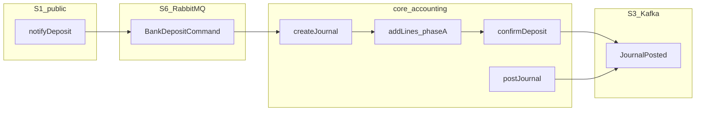

# core.accounting ↔ S2 OpenAPI (design map)

**Nguồn thiết kế** (đọc cạnh nhau):

| Artifact | Path |
|----------|------|
| S2 internal HTTP | [`api-internal.yaml`](./api-internal.yaml) (= [`spec/contracts/open-api/accounting-internal.yaml`](../../spec/contracts/open-api/accounting-internal.yaml)) |
| Journal tables | [`model.md`](./model.md) |
| DR/CR templates | [`postings.md`](./postings.md) |
| Step order | [`../orchestration/flows.md`](../orchestration/flows.md) |
| RabbitMQ ingress | [`../messaging/commands.yaml`](../messaging/commands.yaml) → `BANK_DEPOSIT` |
| Kafka emit | [`events.yaml`](./events.yaml) → `JournalPosted` |
| Surface index | [`../../spec/integration-surfaces.md`](../../spec/integration-surfaces.md) §4, §6 |

Orchestration (BFF) hoặc accounting worker gọi `core.accounting` domain API — **accounting module không expose S1 public HTTP**.

---

## 1. Operation → journal actions

### 1.1 S2 `api-internal.yaml`

| S2 `operationId` | HTTP | Domain method | Note |
|------------------|------|---------------|------|
| `createJournal` | `POST /journal-entries` | `createJournal` | Idempotent `(reference_id, use_case)` |
| `addJournalLines` | `POST /journal-entries/{id}/lines` | `addLines` | Append `coa_trans_data` |
| `postJournal` | `POST /journal-entries/{id}/post` | `postJournal` | Validate DR=CR, transit zero, set POSTED |
| `reverseJournal` | `POST /journal-entries/{id}/reverse` | `reverseJournal` | New reversing journal |
| `getAccountBalance` | `GET /accounts/{id}/balance` | `getBalance` | Sum POSTED lines for `account_code` |
| `getTrialBalance` | `GET /reports/trial-balance` | report query | v1 optional / stub |

### 1.2 Domain-only (chưa trên S2 YAML)

| Domain method | When | Design lock |
|---------------|------|-------------|
| `confirmDeposit(coaTransId, fee)` | Deposit phase B | ADR-006 — **không** dùng `addLines` + `postJournal` từ orchestration cho deposit |

**Gap S2:** `confirmDeposit` có trong [`model.md`](./model.md) và [`spec/implementation.md`](../../spec/implementation.md) §7.5 nhưng **chưa có** path trong [`api-internal.yaml`](./api-internal.yaml).

| Mode | Caller |
|------|--------|
| HTTP (design) | Orchestration / worker qua **S2** `LedgerGateway` → `confirmDeposit` |
| Gap code | `@Autowired JournalService` — migration only, không phải kiến trúc |

### 1.3 Use case orchestration (không 1:1 S2 path)

| Flow | Accounting sequence | `use_case` | Source |
|------|---------------------|------------|--------|
| Deposit async | `createJournal` → `addLines` phase A (PENDING) → `confirmDeposit` (POSTED) | `DEPOSIT` | [`flows.md`](../orchestration/flows.md), [`postings.md`](./postings.md) § Deposit |
| Payment sync | `createJournal` → `addLines` (3500 template) → `postJournal` | `PAYMENT` | [`flows.md`](../orchestration/flows.md), [`postings.md`](./postings.md) § Wallet payment |
| Transfer sync | `createJournal` → `addLines` (3300 template) → `postJournal` | `TRANSFER` | [`postings.md`](./postings.md) § Internal transfer |
| Withdraw | `createJournal` → `addLines` (3200) → `postJournal` after bank settle | `WITHDRAW` | [`postings.md`](./postings.md) § Withdraw |

Flows **không** trên S1/S2 v1 slice: IBFT, Payroll, Disbursement, QR/POS, EOD — xem [`postings.md`](./postings.md) các section tương ứng.

---

## 2. Request/response field → `coa_*` columns

Idempotency: S1 `businessRef` = S6 envelope `businessRef` = S2 `reference_id` = `coa_trans.reference_id` ([`../platform/idempotency.md`](../platform/idempotency.md), [`../../spec/correlation-id-map.md`](../../spec/correlation-id-map.md)).

**UNIQUE:** `(reference_id, use_case)` on `coa_trans`.

### 2.1 `createJournal` — `CreateJournalRequest`

| OpenAPI field | → `coa_*` |
|---------------|-----------|
| `reference_id` | `coa_trans.reference_id` |
| `use_case` | `coa_trans.use_case` |
| `description` | `coa_trans.description` |
| `posting_date` | `coa_trans.posting_date` |
| Response `JournalHeader.id` | `coa_trans.id` |
| Response `JournalHeader.status` | `coa_trans.status` (default `PENDING`) |

### 2.2 `addJournalLines` — `AddJournalLinesRequest`

| OpenAPI field | → `coa_*` |
|---------------|-----------|
| path `id` | `coa_trans_data.coa_trans_id` |
| `lines[].account_code` | `coa_trans_data.account_code` (FK `coa_account.code`) |
| `lines[].side` | `coa_trans_data.side` (`DEBIT` / `CREDIT`) |
| `lines[].amount` | `coa_trans_data.amount` (string → NUMERIC scale 4) |
| `lines[].currency` | `coa_trans_data.currency` (default VND) |

### 2.3 `postJournal` — `PostJournalResult`

| OpenAPI field | → `coa_*` |
|---------------|-----------|
| path `id` | `coa_trans.id` |
| `status` | `coa_trans.status` → `POSTED` |
| `posted_at` | `coa_trans.posted_at` |

Idempotent: `postJournal` on already-POSTED → no-op, return current state.

### 2.4 `reverseJournal` — `ReverseJournalRequest`

| OpenAPI field | → `coa_*` |
|---------------|-----------|
| path `id` | original `coa_trans.id` |
| `reference_id` | new journal `reference_id` (reversal ref) |
| `reason` | `coa_trans.description` on reversal |
| Response `reversal_id` | new `coa_trans.id` |

### 2.5 `getAccountBalance` — `AccountBalance`

| OpenAPI field | Source |
|---------------|--------|
| path `id` | `coa_account.code` |
| query `asOf` | filter POSTED lines by `posting_date` |
| `balance` | derived sum(DR) − sum(CR) on POSTED lines |

### 2.6 Deposit — phase A + `confirmDeposit` (domain)

Orchestration/worker; amounts từ [`postings.md`](./postings.md) (gross 100,000 · fee 1,000 · net 99,000).

| Step | Domain call | Lines (account / side / amount) |
|------|-------------|--------------------------------|
| A | `createJournal(ref, DEPOSIT)` + `addLines` | 1111 DR 100,000; 3100 CR 100,000 |
| B | `confirmDeposit(coaTransId, fee=1000)` | 3100 DR 100,000; 2110 CR 99,000; 2110 DR 1,000; 4110 CR 1,000 |

Phase B: validate `sum(DR)=sum(CR)`, transit **3100 = 0**, set POSTED — inside accounting only (ADR-006). Idempotent: already POSTED → no-op.

### 2.7 Payment sync — orchestration-built lines

Step order: wallet debit → accounting → wallet credit ([`flows.md`](../orchestration/flows.md)).

| Orchestration input (from S1 `PaymentRequest`) | Posting ([`postings.md`](./postings.md) § Wallet payment) |
|------------------------------------------------|-----------------------------------------------------------|
| `businessRef` → `reference_id` | `use_case = PAYMENT` |
| `amount` (gross) | 2110 DR gross; 3500 CR gross |
| `netToMerchant` (or gross) | 3500 DR gross; 2120 CR netToMerchant |

Single `addLines` + `postJournal` — transit **3500 = 0**. Response `coaTransId` = `coa_trans.id`.

### 2.8 Transfer sync

| Orchestration input (S1 `TransferRequest`) | Posting ([`postings.md`](./postings.md) § Internal transfer) |
|--------------------------------------------|----------------------------------------------------------------|
| `businessRef` | `reference_id`, `use_case = TRANSFER` |
| gross = `amount` + `feeAmount` | 2110 DR gross; 3300 CR gross |
| net = `amount` | 3300 DR net; 2110 CR net (recipient) |
| `feeAmount` | 3300 DR fee; 4130 CR fee |

Transit **3300 = 0** on POSTED.

---

## 3. S6 `BANK_DEPOSIT` → accounting

Worker consumes [`commands.yaml`](../messaging/commands.yaml) `BankDepositCommand` after S1 **202** ([`integration-surfaces.md`](../../spec/integration-surfaces.md) §4.1).

| Envelope / payload | Accounting action |
|--------------------|-------------------|
| `businessRef` | `createJournal.reference_id` |
| `memberId` | routing / shard only — **not** stored on `coa_trans` |
| `commandType` | `BANK_DEPOSIT` |
| `messageId` | transport dedup — not idempotency key |
| `payload.amount` | phase A gross: 1111 DR / 3100 CR |
| `payload.vaNumber`, `bankCode`, `receivedAt` | worker validation / audit — not `coa_*` columns v1 |

Worker idempotency: `(BANK_DEPOSIT, businessRef)` — replay → same journal, no duplicate lines (integration-surfaces §6.2 C1).

After phase A PENDING → orchestration/worker calls `confirmDeposit` qua **S2 HTTP** → optional S3 `JournalPosted` → `WalletGateway` credit (`DEPOSIT_CREDIT`).

---

## 4. Errors (S2 ↔ accounting)

Từ [`model.md`](./model.md) § Errors — align `ErrorCode` in `core.sharedlib`:

| `errorCode` | HTTP | Accounting cause |
|-------------|------|------------------|
| `ACCOUNTING_UNBALANCED_JOURNAL` | 422 | `sum(DR) ≠ sum(CR)` at post / confirmDeposit |
| `ACCOUNTING_JOURNAL_NOT_FOUND` | 404 | unknown `coa_trans.id` or account code |
| `ACCOUNTING_DUPLICATE_JOURNAL` | 409 | same `reference_id` + `use_case` with conflicting payload |

---

## 5. Kafka emit (accounting → S3)

Sau journal POSTED, adapter publish [`events.yaml`](./events.yaml) `JournalPosted`:

| Event field | Source |
|-------------|--------|
| `coaTransId` | `coa_trans.id` |
| `businessRef` | `coa_trans.reference_id` |
| `useCase` | `coa_trans.use_case` |
| `postedAt` | `coa_trans.posted_at` |

Consumer (orchestration / wallet worker): if `useCase=DEPOSIT` → trigger wallet `DEPOSIT_CREDIT` ([`integration-surfaces.md`](../../spec/integration-surfaces.md) §5).

---

## 6. Schema cross-ref (OpenAPI ↔ design)

| OpenAPI schema (`api-internal.yaml`) | Design doc |
|--------------------------------------|------------|
| `CreateJournalRequest` | §2.1 + `model.md` → `coa_trans` |
| `JournalHeader` | §2.1 response |
| `JournalLine` | §2.2 + `model.md` → `coa_trans_data` |
| `AddJournalLinesRequest` | §2.2 |
| `PostJournalResult` | §2.3 |
| `ReverseJournalRequest` / `ReverseJournalResult` | §2.4 |
| `AccountBalance` | §2.5 + `coa.md` account codes |
| *(missing)* `ConfirmDepositRequest` | §2.6 domain-only — gap documented §1.2 |
