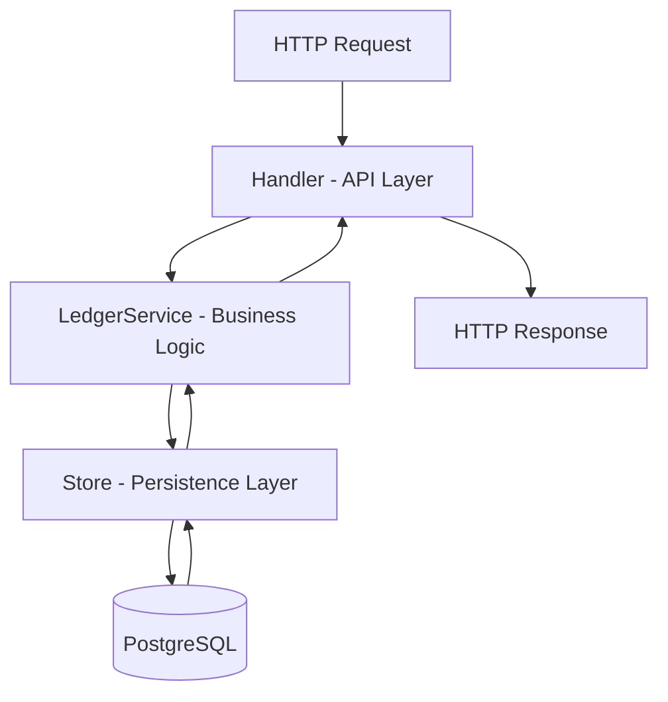

[Learn to code — free 3,000-hour curriculum](https://www.freecodecamp.org/)

[Paul Babatuyi](https://www.freecodecamp.org/news/author/paulbabatuyi/)


## The Hidden Bugs in How Most Developers Store Money

Imagine you're building the backend for a million-dollar fintech app. You store each user's balance as a single number in the database. It feels simple: just update the number when money moves.

But with one line of code like `UPDATE accounts SET balance = balance - 100`, you've created a system that can silently lose millions. A server crash, a race condition, or a clever attack, and suddenly money vanishes or appears out of thin air.

There's no audit trail, no way to know what happened, and no way to prove it didn't happen on purpose.

This isn't just a theoretical risk. It's a trap that's caught even experienced developers. The world's most trusted financial systems avoid it by using double-entry accounting. Every transaction creates two records: a debit on one account, a credit on another. This lets you reconstruct every cent from history, catch inconsistencies, and audit every transaction.

There are no deletes, and no silent updates. Just an append-only trail that makes fraud and bugs much harder to hide.

In this guide, you'll build a robust backend in Go and PostgreSQL, using patterns inspired by real fintech companies. You'll learn how to design a double-entry ledger, generate type-safe SQL with sqlc, and write transactions that are safe even under heavy load.

By the end, you'll understand why these patterns matter – and how to use them to build software you can trust with real money.

## Table of Contents

- [Prerequisites and Project Overview](https://www.freecodecamp.org/news/build-a-bank-ledger-in-go-with-postgresql-using-the-double-entry-accounting-principle/#heading-prerequisites-and-project-overview)

- [The Double-Entry Foundation](https://www.freecodecamp.org/news/build-a-bank-ledger-in-go-with-postgresql-using-the-double-entry-accounting-principle/#heading-the-double-entry-foundation-how-every-penny-is-accounted-for)

- [Type-Safe SQL with sqlc](https://www.freecodecamp.org/news/build-a-bank-ledger-in-go-with-postgresql-using-the-double-entry-accounting-principle/#heading-type-safe-sql-with-sqlc-no-more-surprises)

- [The Store Layer: Transactions and Retries](https://www.freecodecamp.org/news/build-a-bank-ledger-in-go-with-postgresql-using-the-double-entry-accounting-principle/#heading-the-store-layer-transactions-and-automatic-retries)

- [The Service Layer: Business Logic](https://www.freecodecamp.org/news/build-a-bank-ledger-in-go-with-postgresql-using-the-double-entry-accounting-principle/#heading-the-service-layer-where-business-logic-meets-double-entry)

- [The API Layer](https://www.freecodecamp.org/news/build-a-bank-ledger-in-go-with-postgresql-using-the-double-entry-accounting-principle/#heading-the-api-layer-secure-predictable-and-boring-by-design)

- [Running It Locally](https://www.freecodecamp.org/news/build-a-bank-ledger-in-go-with-postgresql-using-the-double-entry-accounting-principle/#heading-running-it-locally-your-first-end-to-end-test)

- [Testing: Prove the System Works](https://www.freecodecamp.org/news/build-a-bank-ledger-in-go-with-postgresql-using-the-double-entry-accounting-principle/#heading-testing-prove-the-system-works)

- [Deployment](https://www.freecodecamp.org/news/build-a-bank-ledger-in-go-with-postgresql-using-the-double-entry-accounting-principle/#heading-deployment-engineering-decisions-that-matter-in-production)

- [Conclusion](https://www.freecodecamp.org/news/build-a-bank-ledger-in-go-with-postgresql-using-the-double-entry-accounting-principle/#heading-conclusion-building-for-the-real-world)


### Project Resources:

Here's the project repository: [https://github.com/PaulBabatuyi/double-entry-bank-Go](https://github.com/PaulBabatuyi/double-entry-bank-Go)

And here's the front-end repository: [https://github.com/PaulBabatuyi/double-entry-bank](https://github.com/PaulBabatuyi/double-entry-bankhttps://github.com/PaulBabatuyi/double-entry-bank)

You can find the live frontend here: [https://golangbank.app](https://golangbank.app/)


You can find the live Swagger back-end API here: [https://golangbank.app/swagger](https://golangbank.app/swagger)


## Prerequisites and Project Overview

Before you dive in, make sure you have the following installed:

- Go 1.23 or newer

- Docker and Docker Compose

- `golang-migrate` CLI: `go install github.com/golang-migrate/migrate/v4/cmd/migrate@latest`

- `sqlc` CLI: `go install github.com/sqlc-dev/sqlc/cmd/sqlc@latest`


You'll also need a basic understanding of PostgreSQL and REST APIs to follow along.

If you've built a CRUD app before, you're ready for this. The project uses sqlc for type-safe queries, JWT for authentication, and a layered architecture that keeps business logic, persistence, and HTTP handling cleanly separated.

Here's how the project is organized:

```plaintext
.
├── cmd/                # Server entrypoint
│   └── main.go
├── internal/
│   ├── api/            # HTTP handlers & middleware
│   ├── db/             # Store layer (transactions, sqlc)
│   └── service/        # Business logic (ledger operations)
├── postgres/
│   ├── migrations/     # SQL migration files
│   └── queries/        # sqlc query files
├── docs/               # Swagger docs
├── Dockerfile, docker-compose.yml, Makefile
└── README.md
```

The architecture follows a clear three-layer pattern:

- **API Layer**: Handles HTTP requests, authentication, and routing.

- **Service Layer**: Contains the business logic. This is where double-entry rules are enforced.

- **Store Layer**: Manages database transactions and persistence.


Every request flows from the handler, through the service, to the store, and finally to PostgreSQL. This separation makes the code easier to test, debug, and extend.

### Backend Request Flow



## The Double-Entry Foundation: How Every Penny is Accounted For

Let's get to the heart of what makes this system bulletproof: double-entry accounting. Every operation – a deposit, withdrawal, or transfer – creates two entries that always balance. This is the secret sauce that keeps banks, payment apps, and even crypto exchanges from losing track of money.

Picture a simple deposit of $1,000:

```plaintext
| Account              | Debit   | Credit  |
|----------------------|---------|---------|
| User Account         |         | 1,000   |
| Settlement Account   | 1,000   |         |
```

Total debits always equal total credits. This is the fundamental rule. Every single operation in this system produces exactly this structure, with no exceptions.

Now picture a $200 transfer from User A to User B. Notice there are four entries, not two – both sides of both accounts are recorded:

```plaintext
| Account       | Debit   | Credit  | Description           |
|---------------|---------|---------|-----------------------|
| User A        | 200     |         | Transfer to User B    |
| User B        |         | 200     | Transfer from User A  |
```

Both entries share the same `transaction_id`, so you can always retrieve the complete picture of what happened with a single query. There's no guessing and no reconstructing, as the ledger tells the full story.

### Why the Settlement Account Goes Negative

This trips up newcomers, so it's worth explaining explicitly. When a user deposits \\(1,000, the settlement account is debited \\)1,000. After several user deposits, the settlement balance will be negative. That's correct and expected: it represents the total amount of real-world money currently held inside the system on behalf of users. The invariant is:

```plaintext
SUM(all user account balances) + settlement balance = 0
```

If that ever doesn't hold, something is broken.

### Enforcing the Rules in the Database

The database itself enforces these rules, not just the application code. Here's the core of the `entries` table migration:

```sql
CREATE TABLE IF NOT EXISTS entries (
    id UUID PRIMARY KEY DEFAULT gen_random_uuid(),
    account_id UUID NOT NULL REFERENCES accounts(id) ON DELETE RESTRICT,
    debit NUMERIC(19,4) NOT NULL DEFAULT 0.0000 CHECK (debit >= 0),
    credit NUMERIC(19,4) NOT NULL DEFAULT 0.0000 CHECK (credit >= 0),
    transaction_id UUID NOT NULL,
    operation_type operation_type NOT NULL,
    description TEXT,
    created_at TIMESTAMP WITH TIME ZONE DEFAULT CURRENT_TIMESTAMP,

    CONSTRAINT check_single_side CHECK (
        (debit > 0 AND credit = 0) OR (debit = 0 AND credit > 0)
    )
);
```

Let's break down why each piece matters:

- **Single-sided entries are impossible.** The `check_single_side` constraint means every entry must be either a debit or a credit, never both. If you try to insert an invalid row, the database rejects it – there's no way around it.

- **Every transaction is linked.** Both the debit and credit entries share the same `transaction_id` (a UUID). This lets you fetch both sides of any operation instantly, making audits and debugging straightforward.

- **Operation types are explicit.** The `operation_type` column is an enum at the database level, so only valid types like `deposit`, `withdrawal`, or `transfer` are allowed. There are no typos and no surprises.


### The Settlement Account: The System's Anchor

Every real-world ledger needs a way to represent money entering or leaving the system. That's what the settlement account does. Here's how it's seeded in the database:

```sql
INSERT INTO accounts (id, name, balance, currency, is_system)
SELECT gen_random_uuid(), 'Settlement Account', 0.0000, 'USD', TRUE
WHERE NOT EXISTS (
    SELECT 1 FROM accounts WHERE is_system = TRUE AND name = 'Settlement Account'
);
```

The settlement account represents the "outside world." When a user deposits money, it comes from the settlement account. When they withdraw, it goes back. Using `WHERE NOT EXISTS` makes this migration idempotent – that is, safe to run multiple times without creating duplicates.

## Type-Safe SQL with sqlc: No More Surprises

In financial systems, you can't afford surprises from your database layer. That's why this project uses sqlc, a tool that turns your SQL queries into type-safe Go code at compile time.

With sqlc, you see exactly what SQL runs, catch mistakes before they hit production, and avoid the "magic" (and hidden bugs) of most ORMs. Every query is explicit, every type is checked, and you get the best of both worlds: raw SQL power with Go's safety.

### Why NUMERIC Becomes String (and Not float64)

Here's a subtle but critical detail from `sqlc.yaml`:

```yaml
overrides:
    - db_type: "pg_catalog.numeric"
      go_type: "string"
    - column: "entries.debit"
      go_type: "string"
    - column: "entries.credit"
      go_type: "string"
    - column: "accounts.balance"
      go_type: "string"
    - db_type: "operation_type"
      go_type: "string"
```

**Why string, not float64?** Floating point arithmetic is imprecise. `0.1 + 0.2` in most programming languages does not equal exactly `0.3`.

For money, you need exact decimal arithmetic. This project uses `shopspring/decimal` for all calculations and stores amounts as strings, converting at the service layer boundary. The database column itself is `NUMERIC(19,4)`, which stores exact decimals – no float rounding ever touches your money.

### Preventing Race Conditions: Locking with FOR UPDATE

One of the most important queries in the system is `GetAccountForUpdate`:

```sql
SELECT * FROM accounts
WHERE id = $1
LIMIT 1
FOR UPDATE; -- locks row for update, prevents TOCTOU races
```

This query uses `FOR UPDATE` to lock the account row during a transaction. Why? Imagine two requests both see a \\(500 balance and both try to withdraw \\)400. Without locking, both would succeed, and you'd end up with a negative balance. With `FOR UPDATE`, the second transaction waits until the first finishes, eliminating this classic race condition.

### Calculating the True Balance: Always Trust the Entries

The real source of truth for any account is the sum of its entries, not the denormalized `balance` column. Here's the reconciliation query:

```sql
SELECT CAST(
    (COALESCE(SUM(credit), 0::NUMERIC) - COALESCE(SUM(debit), 0::NUMERIC))
    AS NUMERIC(19,4)
) AS calculated_balance
FROM entries
WHERE account_id = $1;
```

This computes the true balance from the ledger itself. It's how you catch bugs, audit the system, and prove that every penny is accounted for. The `balance` column on accounts is a denormalized cache for fast reads – and this query is the ground truth that validates it.

## The Store Layer: Transactions and Automatic Retries

Every financial operation in this system runs inside a transaction – no exceptions. This is enforced by the `ExecTx` pattern in the store layer:

```go
func (store *Store) ExecTx(ctx context.Context, fn func(q *sqlc.Queries) error) error {
    const maxAttempts = 10
    var lastErr error
    for attempt := 0; attempt < maxAttempts; attempt++ {
        lastErr = store.execTxOnce(ctx, fn)
        if lastErr == nil {
            return nil
        }
        if !isSerializationError(lastErr) {
            return lastErr
        }
        if attempt < maxAttempts-1 {
            if waitErr := sleepWithContext(ctx, retryWait(attempt)); waitErr != nil {
                return waitErr
            }
        }
    }
    return fmt.Errorf("transaction failed after %d attempts due to serialization conflicts: %w", maxAttempts, lastErr)
}
```

### Why Serializable Isolation?

The transaction uses PostgreSQL's strictest isolation level: `sql.LevelSerializable`. This is like running transactions one at a time, eliminating entire classes of concurrency bugs. If two operations would conflict, PostgreSQL aborts one and returns a serialization error (SQLSTATE 40001).

### Automatic Retries: Handling Real-World Concurrency

When a serialization error occurs, the code automatically retries with exponential backoff:

```go
func retryWait(attempt int) time.Duration {
    base := 50 * time.Millisecond
    for i := 0; i < attempt; i++ {
        base *= 2
        if base >= time.Second {
            return time.Second
        }
    }
    return base
}

func sleepWithContext(ctx context.Context, d time.Duration) error {
    select {
    case <-ctx.Done():
        return ctx.Err()
    case <-time.After(d):
        return nil
    }
}
```

The backoff starts at 50ms and doubles each attempt, capping at 1 second. Up to 10 attempts are made. If the client disconnects mid-retry, `sleepWithContext` detects the cancelled context and returns immediately. This means no wasted resources.

## The Service Layer: Where Business Logic Meets Double-Entry

The service layer is the heart of the system. Its job is to translate business operations – deposits, withdrawals, transfers – into double-entry journal entries that always balance.

### Deposit: Crediting the User, Debiting the Settlement

Every deposit creates two entries: a credit to the user's account and a matching debit to the settlement account. Both entries share the same transaction ID.

```go
func (s *LedgerService) Deposit(ctx context.Context, accountID uuid.UUID, amountStr string) error {
    amount, err := validatePositiveAmount(amountStr)
    if err != nil {
        return err
    }
    return s.store.ExecTx(ctx, func(q *sqlc.Queries) error {
        settlement, err := q.GetSettlementAccountForUpdate(ctx)
        if err != nil {
            return fmt.Errorf("settlement account not found: %w", err)
        }
        account, err := q.GetAccountForUpdate(ctx, accountID)
        if err != nil {
            return fmt.Errorf("account not found: %w", err)
        }
        if account.Currency != settlement.Currency {
            return ErrCurrencyMismatch
        }
        txID := uuid.New()
        // 1. Credit user account
        _, err = q.CreateEntry(ctx, sqlc.CreateEntryParams{
            AccountID:     accountID,
            Debit:         decimal.Zero.StringFixed(4),
            Credit:        amount.StringFixed(4),
            TransactionID: txID,
            OperationType: "deposit",
            Description:   sql.NullString{String: "External deposit", Valid: true},
        })
        if err != nil { return err }
        // 2. Debit settlement (opposing entry)
        _, err = q.CreateEntry(ctx, sqlc.CreateEntryParams{
            AccountID:     settlement.ID,
            Debit:         amount.StringFixed(4),
            Credit:        decimal.Zero.StringFixed(4),
            TransactionID: txID,
            OperationType: "deposit",
            Description:   sql.NullString{String: fmt.Sprintf("Deposit to account %s", accountID), Valid: true},
        })
        if err != nil { return err }
        // 3. Update both balances atomically
        if err = q.UpdateAccountBalance(ctx, sqlc.UpdateAccountBalanceParams{
            Balance: amount.StringFixed(4), ID: accountID,
        }); err != nil { return err }
        return q.UpdateAccountBalance(ctx, sqlc.UpdateAccountBalanceParams{
            Balance: amount.Neg().StringFixed(4), ID: settlement.ID,
        })
    })
}
```

Two things are worth highlighting. First, both accounts are locked with `GetAccountForUpdate` and `GetSettlementAccountForUpdate` before any entries are written. This prevents any other concurrent transaction from reading a stale balance and acting on it.

Second, `amount.Neg()` is used to debit the settlement. Its balance goes down, representing real money now held inside the system.

### Withdraw: Debiting the User, Crediting the Settlement

Withdrawals are the mirror image of deposits. The key difference is the insufficient funds check, which must happen inside the transaction after the lock is acquired:

```go
balanceDec, err := decimal.NewFromString(account.Balance)
if err != nil {
    return errors.New("invalid balance")
}
if balanceDec.LessThan(amount) {
    return ErrInsufficientFunds
}
```

Checking balance inside the transaction after `FOR UPDATE` is critical. Checking it before, outside the transaction, would create a classic time-of-check-to-time-of-use (TOCTOU) race. Two concurrent withdrawals could both pass the check, then both execute, overdrawing the account.

The entries for a $500 withdrawal look like this:

```plaintext
| Account              | Debit   | Credit  |
|----------------------|---------|---------|
| User Account         | 500     |         |
| Settlement Account   |         | 500     |
```

The settlement is credited because real money is leaving the system, and it's being "returned" to the outside world.

### Transfer: User-to-User, No Settlement Involved

Transfers move money directly between two user accounts. The settlement account isn't involved. Both accounts are locked, currency is validated, and an insufficient funds check runs before any entries are created:

```go
func (s *LedgerService) Transfer(ctx context.Context, fromID, toID uuid.UUID, amountStr string) error {
    amount, err := validatePositiveAmount(amountStr)
    if err != nil { return err }
    if fromID == toID {
        return ErrSameAccountTransfer
    }
    return s.store.ExecTx(ctx, func(q *sqlc.Queries) error {
        fromAcc, err := q.GetAccountForUpdate(ctx, fromID)
        if err != nil { return err }
        toAcc, err := q.GetAccountForUpdate(ctx, toID)
        if err != nil { return err }
        if fromAcc.Currency != toAcc.Currency {
            return ErrCurrencyMismatch
        }
        fromBalance, _ := decimal.NewFromString(fromAcc.Balance)
        if fromBalance.LessThan(amount) {
            return ErrInsufficientFunds
        }
        txID := uuid.New()
        // Debit sender, credit receiver — same transaction ID
        // ... CreateEntry calls + UpdateAccountBalance calls
    })
}
```

A $200 transfer creates exactly two entries under the same `transaction_id`:

```plaintext
| Account  | Debit   | Credit  |
|----------|---------|---------|
| Sender   | 200     |         |
| Receiver |         | 200     |
```

### ReconcileAccount: Trust, But Verify

Reconciliation is how you prove the system is correct. The `ReconcileAccount` function compares the stored `balance` column against the sum of all credits minus debits in the entries table:

```go
func (s *LedgerService) ReconcileAccount(ctx context.Context, accountID uuid.UUID) (bool, error) {
    account, err := s.store.GetAccount(ctx, accountID)
    if err != nil { return false, fmt.Errorf("account not found: %w", err) }

    calculatedStr, err := s.store.GetAccountBalance(ctx, accountID)
    if err != nil { return false, fmt.Errorf("failed to calculate balance: %w", err) }

    calculated, _ := decimal.NewFromString(calculatedStr)
    stored, _ := decimal.NewFromString(account.Balance)

    if !stored.Equal(calculated) {
        log.Error().
            Str("stored_balance", account.Balance).
            Str("calculated", calculated.StringFixed(4)).
            Msg("Balance mismatch detected")
        return false, fmt.Errorf("balance mismatch: stored %s, calculated %s",
            account.Balance, calculated.StringFixed(4))
    }
    return true, nil
}
```

If they don't match, something has gone wrong: a bug, a direct database modification, or a race condition that slipped through. In production, this check can run as a background job to catch issues before they become incidents.

## The API Layer: Secure, Predictable, and Boring (By Design)

The API layer is where your business logic meets the outside world. Its job is to be secure, predictable, and, if you've done things right, a little bit boring.

### JWT Authentication: Secrets Matter

Authentication is handled with JWTs. The secret used to sign tokens must be at least 32 characters long (as shorter secrets are insecure and can be brute-forced). This is enforced at startup:

```go
// internal/api/middleware.go
func InitTokenAuth(secret string) error {
    if secret == "" {
        return errors.New("JWT_SECRET environment variable is required")
    }
    if len(secret) < 32 {
        return errors.New("JWT_SECRET must be at least 32 characters")
    }
    TokenAuth = jwtauth.New("HS256", []byte(secret), nil)
    return nil
}
```

The server will refuse to start if the secret is missing or too short. There's no fallback and no default: the system fails loudly rather than running insecurely.

### The Handler Pattern: Parse, Authorize, Validate, Call, Respond

Every handler follows the same recipe: extract JWT claims, parse the account ID, fetch the account and verify ownership, decode the request body, call the service, and respond. Authorization always happens before calling the service layer. The service knows nothing about users, keeping business logic clean and testable.

```go
// internal/api/handler.go
func (h *Handler) Register(w http.ResponseWriter, r *http.Request) {
    var input struct {
        Email    string `json:"email"`
        Password string `json:"password"`
    }
    if err := json.NewDecoder(r.Body).Decode(&input); err != nil {
        respondError(w, http.StatusBadRequest, "invalid input")
        return
    }
    // ... hash password, create user, generate JWT ...
}
```

### Amount Normalization: Defensive by Default

API clients send amounts in different formats – sometimes as strings, sometimes as numbers. The normalization logic ensures all amounts are handled safely:

```go
// internal/api/amount.go
func normalizeAmountInput(value interface{}) (string, error) {
    switch v := value.(type) {
    case string:
        return strings.TrimSpace(v), nil
    case json.Number:
        return strings.TrimSpace(v.String()), nil
    case float64:
        return strconv.FormatFloat(v, 'f', -1, 64), nil
    default:
        return "", errors.New("amount must be a number or string")
    }
}
```

The decoder uses `dec.UseNumber()` so JSON numbers arrive as `json.Number` rather than `float64`, preserving full precision. The `float64` case exists as a safety fallback only.

### Frontend Deployment Boundary

The backend no longer serves static frontend files. The frontend is deployed separately at `https://golangbank.app` from its own repository: `https://github.com/PaulBabatuyi/double-entry-bank`.

## Running It Locally: Your First End-to-End Test

```bash
git clone https://github.com/PaulBabatuyi/double-entry-bank-Go.git
cd double-entry-bank-Go
cp .env.example .env
# Edit .env — set JWT_SECRET with: openssl rand -base64 32
make postgres
make migrate-up
make server
```

Once the server is running:

- **Frontend**: [https://golangbank.app](https://golangbank.app/)

- **Swagger UI**: [http://localhost:8080/swagger/index.html](http://localhost:8080/swagger/index.html) (local dev) or [https://golangbank.app/swagger](https://golangbank.app/swagger) (production)

- **Health check**: [http://localhost:8080/health](http://localhost:8080/health)


The Swagger UI lets you explore every endpoint, authorize with your JWT token, and test operations directly in the browser.

## Testing: Prove the System Works

Testing financial systems is non-negotiable, and claims about correctness need to be backed by code. This project tests all three layers, each targeting a different kind of failure.

### Service Layer: Core Financial Logic

The most important tests live in `internal/service/ledger_test.go`. They run against a real PostgreSQL database – not mocks – because mock-based tests can give a false sense of security. Real database tests catch issues that only appear in production-like environments.

```go
func TestDeposit_Success(t *testing.T) {
    ledger := setupTestLedger(t)
    accountID := createTestAccount(t, ledger, "0.00")

    err := ledger.Deposit(context.Background(), accountID, "100.00")
    require.NoError(t, err)

    balance := getAccountBalance(t, ledger, accountID)
    assert.Equal(t, "100.0000", balance)
}

func TestWithdraw_InsufficientFunds(t *testing.T) {
    ledger := setupTestLedger(t)
    accountID := createTestAccount(t, ledger, "50.00")

    err := ledger.Withdraw(context.Background(), accountID, "100.00")
    assert.ErrorIs(t, err, ErrInsufficientFunds)
}
```

The `createTestAccount` helper uses the settlement account's currency automatically, which is important: all accounts must share a currency for transfers to work, and tests that silently use a different currency will fail in confusing ways.

### Concurrency Test: Proving Serializable Isolation Works

This is the most important test in the suite:

```go
func TestConcurrentDeposits(t *testing.T) {
    ledger := setupTestLedger(t)
    accountID := createTestAccount(t, ledger, "0.00")

    var wg sync.WaitGroup
    wg.Add(2)
    go func() {
        defer wg.Done()
        _ = ledger.Deposit(context.Background(), accountID, "100.00")
    }()
    go func() {
        defer wg.Done()
        _ = ledger.Deposit(context.Background(), accountID, "100.00")
    }()
    wg.Wait()

    balance := getAccountBalance(t, ledger, accountID)
    assert.Equal(t, "200.0000", balance)
}
```

Two goroutines deposit simultaneously. The serializable isolation level and retry logic ensure both operations succeed and neither overwrites the other. Without the `FOR UPDATE` locks and transaction retry logic, this test would fail non-deterministically – which is exactly the kind of bug that's impossible to reproduce in development but devastating in production.

### Store Layer: Transaction Mechanics

Tests in `internal/db/store_test.go` verify the retry infrastructure itself, without needing a database connection:

```go
func TestIsSerializationError(t *testing.T) {
    pqErr := &pq.Error{Code: "40001"}
    assert.True(t, isSerializationError(pqErr))
    assert.False(t, isSerializationError(errors.New("some other error")))
}

func TestRetryWait(t *testing.T) {
    assert.Equal(t, 50*time.Millisecond, retryWait(0))
    assert.Equal(t, 100*time.Millisecond, retryWait(1))
    assert.Equal(t, 200*time.Millisecond, retryWait(2))
    assert.Equal(t, time.Second, retryWait(5)) // capped
}

func TestSleepWithContext_Cancel(t *testing.T) {
    ctx, cancel := context.WithCancel(context.Background())
    cancel() // cancel immediately
    err := sleepWithContext(ctx, 50*time.Millisecond)
    assert.Error(t, err) // should return immediately, not wait
}
```

### API Layer: Authentication and Input Handling

Handler tests in `internal/api/handler_test.go` verify that the HTTP layer behaves correctly at its boundaries:

```go
func TestRegisterHandler_BadRequest(t *testing.T) {
    h := setupTestHandler(t)
    req := httptest.NewRequest(http.MethodPost, "/register", nil)
    rw := httptest.NewRecorder()
    h.Register(rw, req)
    assert.Equal(t, http.StatusBadRequest, rw.Code)
}

func TestRegisterHandler_Success(t *testing.T) {
    h := setupTestHandler(t)
    _ = InitTokenAuth("fV7sliKV3qn657I60wEFtw/Auk/0bNU9zdp30wFzfDg=")

    email := "testuser_" + uuid.New().String() + "@example.com"
    body, _ := json.Marshal(map[string]string{"email": email, "password": "testpassword123"})

    req := httptest.NewRequest(http.MethodPost, "/register", bytes.NewReader(body))
    rw := httptest.NewRecorder()
    h.Register(rw, req)
    assert.Equal(t, http.StatusCreated, rw.Code)
}
```

Using `uuid.New().String()` in the email ensures each test run creates a unique user, preventing conflicts on repeated runs against the same database.

Middleware tests verify the security boundary itself:

```go
func TestInitTokenAuthFromEnv_MissingSecret(t *testing.T) {
    os.Unsetenv("JWT_SECRET")
    err := InitTokenAuthFromEnv()
    assert.Error(t, err) // must fail without a secret
}
```

### Running the Tests

```bash
# Start the database
make postgres

# Run all tests with race detection
make test

# Run with coverage report
make coverage

# Run tests the same way CI does (includes migrations)
make ci-test
```

The `-race` flag is non-negotiable for financial code. It instruments the binary to detect data races at runtime – something static analysis can't catch. If a race exists, the race detector will find it.

## Deployment: Engineering Decisions That Matter in Production

The deployment setup for this project reflects several engineering decisions worth understanding, regardless of what platform you deploy to.

### Migrations on Container Start

The Docker entrypoint runs `golang-migrate up` before starting the Go binary:

```sh
# docker-entrypoint
migrate -path /app/postgres/migrations -database "$migrate_db_url" up
exec /usr/local/bin/ledger
```

Running migrations at startup rather than as a separate CI step has trade-offs. The upside is simplicity: the container is always self-consistent when it starts. The downside is that each deployment takes slightly longer. For a solo project or small team, this is the right call. At scale you'd separate migrations from deployment.

### Startup Retry Logic

The entrypoint retries migrations up to 12 times with a 5-second sleep between attempts:

```sh
max_attempts=12
attempt=1
while [ "\(attempt" -le "\)max_attempts" ]; do
    migration_output=$(migrate ... up 2>&1)
    # If "connection refused" or "timeout", keep retrying
    # If any other error, fail immediately
    attempt=$((attempt + 1))
done
```

The critical distinction is which errors trigger a retry. Network-transient errors (connection refused, timeout) are retried. Everything else – a bad migration SQL, a missing tabl – fails immediately. This avoids waiting the full 60 seconds when a deployment has a real problem.

### DB URL Fallback Chain

In cloud environments, the internal database URL is often a different variable than what you configure locally. The `resolveDBURL` function handles this transparently:

```go
func resolveDBURL() string {
    connStr := strings.TrimSpace(os.Getenv("DB_URL"))
    fallbackVars := []string{"INTERNAL_DATABASE_URL", "RENDER_DATABASE_URL", "DATABASE_URL"}
    // Falls back through the chain if DB_URL is empty or resolves to localhost
    ...
}
```

This pattern means local developers set `DB_URL` in `.env` and don't need to think about it, while the deployed container automatically uses the internal database connection without any manual wiring.

### HTTP Server Timeouts

The server is configured with explicit timeouts:

```go
srv := &http.Server{
    Addr:              ":" + port,
    Handler:           r,
    ReadTimeout:       15 * time.Second,
    WriteTimeout:      15 * time.Second,
    IdleTimeout:       60 * time.Second,
    ReadHeaderTimeout: 5 * time.Second,
}
```

Without timeouts, a slow or malicious client can hold connections open indefinitely, eventually exhausting the server's resources. `ReadHeaderTimeout` is particularly important: it limits how long the server waits for the HTTP headers before closing the connection, protecting against Slowloris-style attacks.

## Conclusion: Building for the Real World

You've just walked through the core patterns that power real fintech systems:

- Double-entry ledger with database-enforced constraints

- Settlement account for tracking external cash flows

- Serializable transactions with exponential backoff retry

- Reconciliation endpoint for verifying correctness

- Type-safe queries with sqlc

- Row-level locking to prevent race conditions

- Tests that prove correctness under concurrency


These aren't just Go patterns. They're the same principles used at companies like Monzo, Stripe, and Nubank. The implementation details differ, but the underlying ideas are the same: every dollar is accounted for, every operation is atomic, and the system can always explain where every penny went.

What's next? Three concrete next steps:

1. **Add idempotency keys** to prevent duplicate transactions on retries. If a client retries a deposit because of a network timeout, you need to detect and reject the duplicate.

2. **Add Prometheus metrics** for transaction latency and failure rates. You want to know when your p99 latency spikes before your users do.

3. **Add a scheduled reconciliation job** that runs `ReconcileAccount` for every account on a schedule and alerts on mismatches. Catch bugs automatically, before they become customer complaints.


The developer who stores balance as a single number and updates it directly will eventually have an incident. The developer who builds a ledger has an audit trail, a reconciliation tool, and a system that can explain every penny.

That's the real reason fintech engineers build this way: not because it's more complex, but because it's more honest about what money actually is.

* * *

[Paul Babatuyi](https://www.freecodecamp.org/news/author/paulbabatuyi/)

curious resilient and coachable person

* * *

If you read this far, thank the author to show them you care. Say Thanks

Learn to code for free. freeCodeCamp's open source curriculum has helped more than 40,000 people get jobs as developers. [Get started](https://www.freecodecamp.org/learn)

ADVERTISEMENT