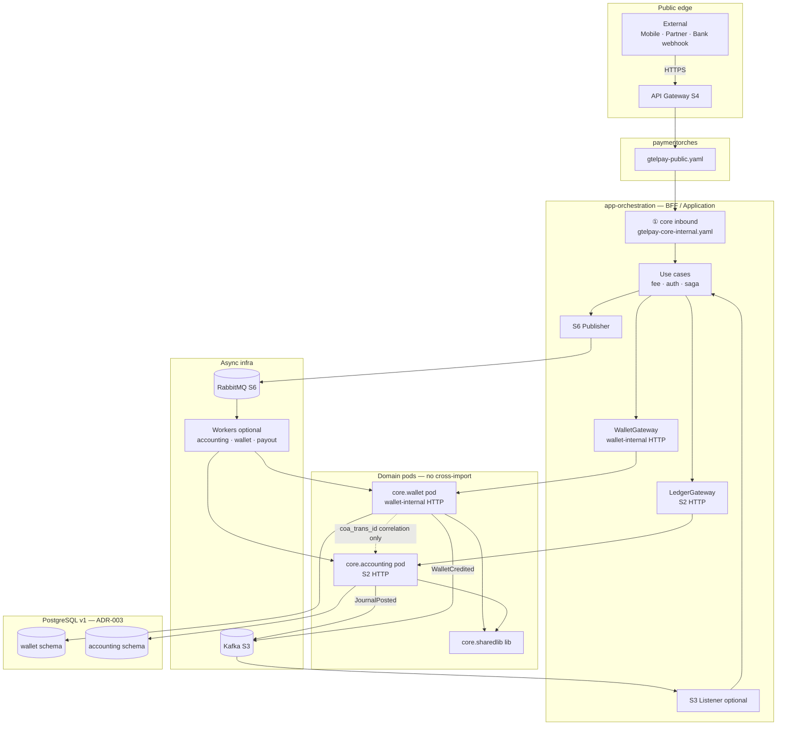
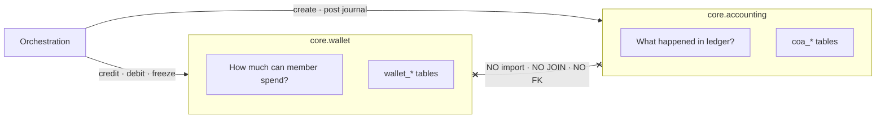
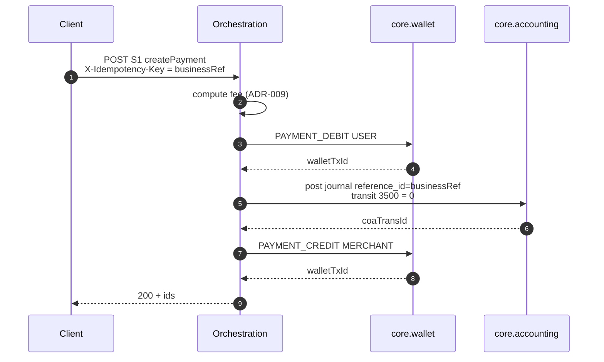
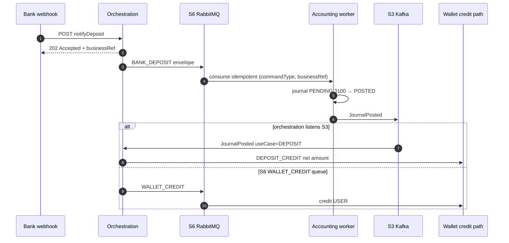
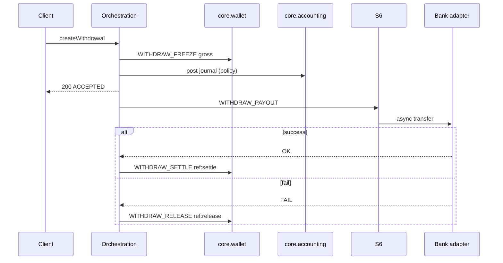
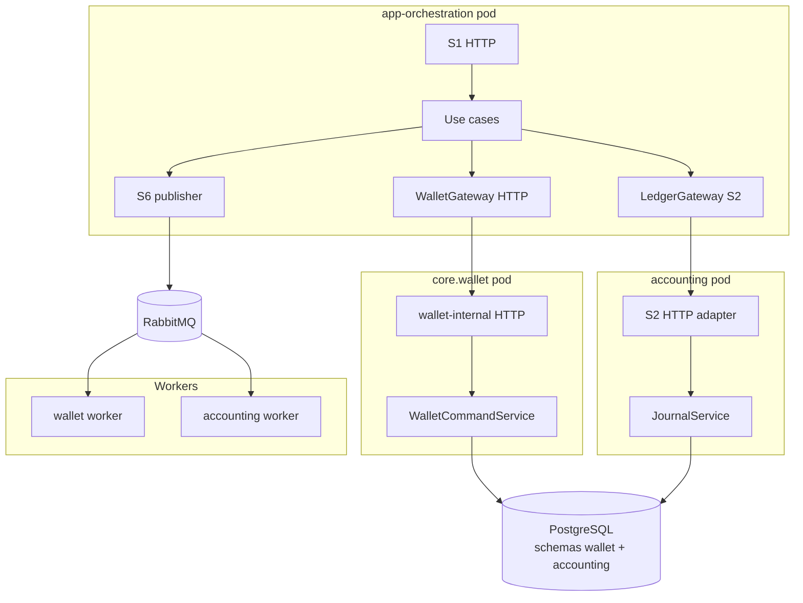

# Architecture overview — Orchestration wraps cores

**Author:** Cao Khang Đoàn  
**Last updated:** 2026-06-12  
**Status:** Draft — **entry point** cho kiến trúc runtime GtelPay Core  

> **Purpose:** Sơ đồ tổng quan gốc — orchestrator (BFF) đứng trước hai core, contract sync/async, ranh giới cấm.  
> **Chi tiết:** [`integration-surfaces.md`](./integration-surfaces.md) · [`processes.md`](./processes.md) · [`implementation.md`](./implementation.md) · identity keys → [`correlation-id-map.md`](./correlation-id-map.md)

---

## 1. Vai trò orchestration

**Orchestration (Application / BFF) không phải domain.** Ranh giới S1 — **auth + validate** trước khi gọi core:

| Lớp | Việc | Ví dụ |
|-----|------|-------|
| **Auth** | Xác thực caller, suy `memberId` từ principal — **không** tin body ([ADR-011](../adr/ADR-011-auth-identity-jwt-subject.md)) | JWT `sub`, webhook mTLS, 401/403 |
| **Validate** | Preconditions wire + nghiệp vụ nhẹ trước domain | `X-Idempotency-Key`, amount/currency, body payer = sub |
| **Delegate** | Sau khi pass auth/validate → gọi wallet / accounting / S6 | Không SQL trực tiếp `wallet_*` / `coa_*` |

**Không phải orchestration:** sequence debit→journal→credit (workflow / use case), tính phí chi tiết, saga recovery — chạy **sau** auth/validate, có thể nằm use case hoặc worker ([ADR-009](../adr/ADR-009-fee-ownership-orchestration.md), [ADR-008](../adr/ADR-008-saga-compensation-no-2pc.md)).

**Cấm (ADR-012):** orchestration **không** INSERT/UPDATE trực tiếp `wallet_*` / `coa_*`.

**Prototype v1 (code gap):** Vert.x S1 + `@Autowired` domain trong cùng JVM — **không** phải kiến trúc; xem [ADR-038](../adr/ADR-038-orchestrator-separate-service-gateway-seam.md) · [`implementation.md`](./implementation.md) §9.0.

---

## 2. Kiến trúc tổng quan



**ASCII — kiến trúc (ADR-038):**

```
paymentorches ──► app-orchestration pod
                    ├── WalletGateway ──HTTP──► core.wallet pod
                    ├── LedgerGateway ──S2 HTTP──► core.accounting pod
                    ├── S6 RabbitMQ ──► workers
                    └── S3 Kafka (fan-out)
```

---

## 3. Hai core — ranh giới cứng



| Rule | Detail |
|------|--------|
| No cross-import | `core.wallet` ↮ `core.accounting` |
| No cross-schema JOIN / FK | `wallet_tx.coa_trans_id` = correlation only ([ADR-003](../adr/ADR-003-dual-schema-single-postgres.md)) |
| Sync alignment | Chỉ qua orchestration — domains **never** call each other |
| Wallet → ledger | **Never** — DR/CR luôn orchestration → accounting |
| Ledger → wallet | **Never** — credit/debit luôn orchestration → wallet |

Chi tiết: [`design/platform/boundaries.md`](../design/platform/boundaries.md) · [`foundation.md`](./foundation.md) Part I §3.

---

## 4. Surface map (S1–S6) — chỉ tại `app-orchestration`

| ID | Surface | Protocol | Spec | Vai trò tại app-orchestration |
|----|---------|----------|------|------------------------------|
| **—** | Core inbound API | HTTPS | [`spec/contracts/open-api/gtelpay-core-internal.yaml`](./contracts/open-api/gtelpay-core-internal.yaml) | **Implement** — paymentorches → orch |
| *(ref)* | Public channel | HTTPS | [`spec/contracts/open-api/gtelpay-public.yaml`](./contracts/open-api/gtelpay-public.yaml) | **paymentorches** |
| **S2** | Accounting client | HTTPS | [`spec/contracts/open-api/accounting-internal.yaml`](./contracts/open-api/accounting-internal.yaml) | **Call** `LedgerGateway` → accounting pod |
| — | Wallet client | HTTPS | [`spec/contracts/open-api/wallet-internal.yaml`](./contracts/open-api/wallet-internal.yaml) | **Call** `WalletGateway` → wallet pod |
| **S3** | Domain events | Kafka | [`spec/contracts/async-api/core-events.yaml`](./contracts/async-api/core-events.yaml) | Publish / consume trong orch |
| **S4** | Gateway routes (tham chiếu) | Config | [`routes.example.yaml`](./contracts/gateway/routes.example.yaml) | Platform config — không gắn domain |
| **S5** | Wire envelope | Library | [`foundation.md`](./foundation.md) Part I §4 | Shape S1/S2/S6 |
| **S6** | Worker commands | RabbitMQ | [`spec/contracts/async-api/core-commands.yaml`](./contracts/async-api/core-commands.yaml) | **Publish** từ orch |

| Domain | Gọi từ orch | Deploy |
|--------|-------------|--------|
| **Wallet** | `WalletGateway` → `wallet-internal.yaml` | **Pod riêng** — không embed orch JVM |
| **Accounting** | `LedgerGateway` → S2 | **Pod riêng** — không embed orch JVM |

**Domain không own S1–S6** — chỉ app-orchestration. In-process cùng JVM = nợ code, không ghi diagram ([ADR-038](../adr/ADR-038-orchestrator-separate-service-gateway-seam.md)).

---

## 5. Contract orchestration ↔ core

| Đích | Contract | Hình thức | Sync / Async |
|------|----------|-----------|--------------|
| **Wallet** | Domain service API (`credit`, `debit`, `freeze`, `getBalance`, …) | `WalletGateway` → **HTTP** `wallet-internal.yaml` | **Sync** |
| **Accounting** | Journal API (`createJournal`, `addLines`, `post`, …) | `LedgerGateway` → **S2 HTTP** `accounting-internal.yaml` | **Sync** (ACID trong accounting schema) |
| **Workers** | `CommandEnvelope` — `businessRef`, `commandType`, `payload` | S6 RabbitMQ | **Async** — fire-and-forget + idempotent consumer |
| **Fan-out / notify** | `JournalPosted`, `WalletCredited`, … | S3 Kafka | **Async** — optional path (deposit credit) |
| **Ra ngoài** | S1 REST | HTTPS qua Gateway | Theo use case (200 vs 202) |

**Không có một contract duy nhất** sync hay async cho toàn hệ — **tùy luồng nghiệp vụ**.

---

## 6. Sync vs async — theo use case

| Luồng | Client S1 | Wallet ↔ Accounting trong orchestration | Messaging | Ghi chú |
|-------|-----------|-------------------------------------------|-----------|---------|
| **Payment** | Sync → **200** | Sync 1 request: debit → post → credit | S6 không bắt buộc | Terminal state trước khi trả client |
| **Transfer** | Sync → **200** | Sync: debit A → post → credit B | S6 không bắt buộc | |
| **Deposit** | Async → **202** | Async qua worker | S6 `BANK_DEPOSIT` → S3 / S6 wallet credit | Không distributed TX |
| **Withdraw** | Sync accept → **200** | Sync freeze + post tại accept | S6 `WITHDRAW_PAYOUT` bank async | Hybrid |
| **IBFT** | Sync accept → **200** | Sync freeze + post | S6 `IBFT_PAYOUT` | Hybrid + poll timeout |
| **Balance read** | Sync → **200** | Query wallet only | — | Không ghi ledger |

**Định nghĩa:**

| Pattern | Nghĩa |
|---------|-------|
| **Sync** | Caller chờ trạng thái terminal wallet + ledger (theo policy use case) trong **cùng request HTTP** S1 |
| **Async** | S1 **202** + worker; saga/compensation; retry idempotent — **không 2PC** |

Matrix wire: [`integration-surfaces.md`](./integration-surfaces.md) §4 · step order ngắn: [`design/orchestration/flows.md`](../design/orchestration/flows.md).

---

## 7. Luồng ví dụ

### 7.1 Payment (sync) — domain service trực tiếp



```
S1 createPayment
  → wallet.debit(USER)
  → accounting.post (S2 / JournalService)
  → wallet.credit(MERCHANT)
  → S1 200
```

### 7.2 Deposit (async) — qua S6 + optional S3



```
S1 webhook → 202
  → S6 BANK_DEPOSIT → accounting worker (PENDING → POSTED)
  → S3 JournalPosted hoặc S6 WALLET_CREDIT
  → wallet DEPOSIT_CREDIT
```

### 7.3 Withdraw (hybrid)



---

## 8. Module deploy

### 8.1 Deploy split (ADR-038)



### 8.2 Code gap (migration — không phải kiến trúc)

Repo hiện gộp orch + domain trong **một JVM** (`@Autowired`) — cần thay bằng HTTP gateway impl. Không dùng làm sơ đồ tham chiếu.

| Module | Trạng thái code |
|--------|-----------------|
| `app-orchestration` | Vert.x S1; payment + balance IT — **chưa** HTTP client tới wallet/accounting pod |
| `core.wallet` pod + `wallet-internal` adapter | Chưa deploy tách |
| `core.accounting` pod + S2 adapter | Chưa deploy tách |
| S6 / S3 | Chưa implement |

**Đã implement (IT):** `GET /v1/wallets/balance`, `POST /v1/payments`, `GET /health`.  
**Chưa:** HTTP gateways, pod split, transfer, withdraw, deposit+S6, PostgreSQL prod.

Layout chi tiết: [`implementation.md`](./implementation.md) §1 · §9.

---

## 9. Khóa & phí xuyên suốt

| Concern | Rule | Doc |
|---------|------|-----|
| **Idempotency** | `businessRef` end-to-end: S1 `X-Idempotency-Key` = S2 `reference_id` = S6 envelope = `wallet_tx.business_ref` | [ADR-005](../adr/ADR-005-idempotency-key-strategy.md) · [`correlation-id-map.md`](./correlation-id-map.md) |
| **Phí** | Orchestration tính gross/fee/net **trước** domain calls; accounting ghi lines nhận được; wallet không tự split | [ADR-009](../adr/ADR-009-fee-ownership-orchestration.md) |
| **Trace** | `correlationId` optional (log) — **không** thay `businessRef` | [`correlation-id-map.md`](./correlation-id-map.md) §8 |

---

## 10. Ai được gọi gì

| Caller | Wallet | Accounting | S1 | S2 | S6 |
|--------|--------|------------|----|----|-----|
| Orchestration | ✓ HTTP client | ✓ S2 HTTP client | ✓ implement | ✓ client | ✓ publish |
| API Gateway | ✗ | ✗ | route → orch | ✗ | ✗ |
| Partner / bank | ✗ | ✗ | qua Gateway | ✗ | ✗ |
| Wallet worker | ✓ own module | ✗ | ✗ | ✗ | consume |
| Accounting worker | ✗ | ✓ own module | ✗ | ✗ | consume |

---

## 11. Doc map — đọc tiếp

| Cần | File |
|-----|------|
| Surface index + forbidden F1–F6 | [`integration-surfaces.md`](./integration-surfaces.md) |
| End-to-end processes + saga | [`processes.md`](./processes.md) |
| Behavior đầy đủ orchestration | [`design-v2/orchestration.md`](../design-v2/orchestration.md) |
| Step order 1 trang | [`design/orchestration/flows.md`](../design/orchestration/flows.md) |
| Repo + D1–D5 + build phases | [`implementation.md`](./implementation.md) |
| Identity keys diagram | [`correlation-id-map.md`](./correlation-id-map.md) |
| ADR index | [`adr/README.md`](../adr/README.md) |
