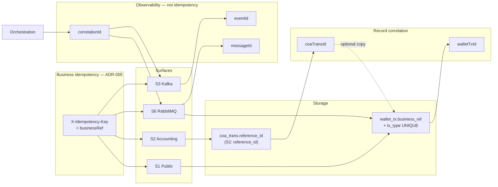
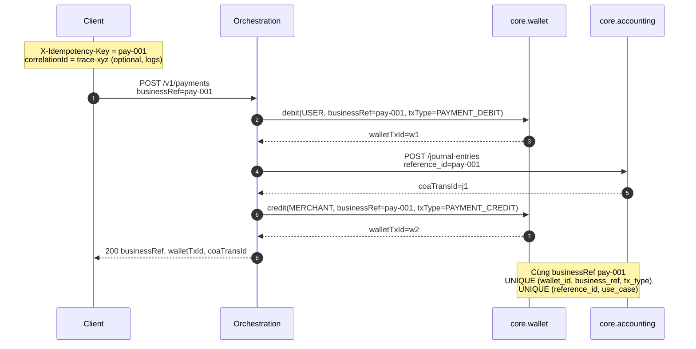
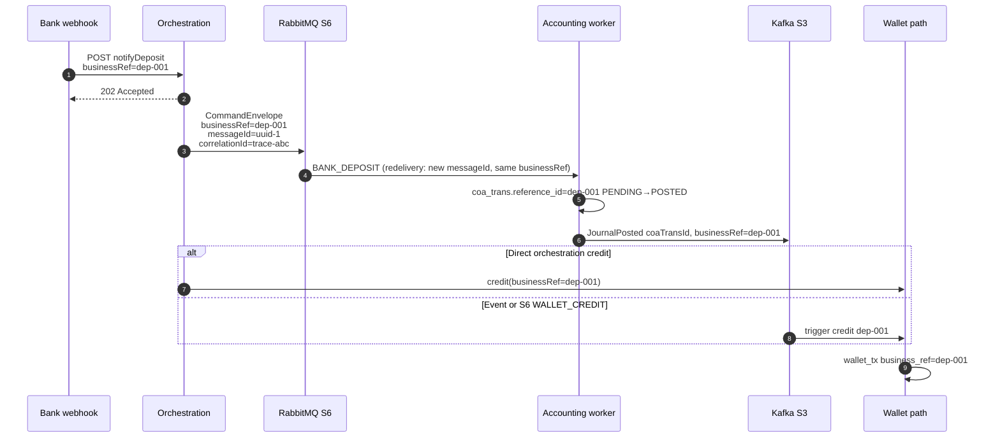

# Correlation & idempotency — identity map

**Author:** Cao Khang Đoàn  
**Last updated:** 2026-06-08  
**Status:** Draft — canonical index for trace vs business keys  

> **Purpose:** Làm rõ `request_id` có hay không, quan hệ `reference_id` ↔ `business_ref`, identity flow.  
> **Kiến trúc tổng quan:** [`architecture-overview.md`](./architecture-overview.md) — orchestration wrap cores, sync/async.  
> **Binding:** [ADR-005](../adr/ADR-005-idempotency-key-strategy.md), [`integration-surfaces.md`](./integration-surfaces.md) §8, [`terminology.md`](./terminology.md).

---

## 1. TL;DR

| Câu hỏi | Trả lời |
|---------|---------|
| **`request_id` xuyên suốt toàn hệ?** | **Không có field tên `request_id`** trên wire. HTTP trace (vd. `X-Request-Id`) → map **`correlationId`** (optional) — xuyên HTTP→S6→S3, không ghi DB. |
| **`reference_id` vs `business_ref`?** | **Cùng một giá trị** — S1/S6 `businessRef`; S2 `reference_id` → `coa_trans.reference_id`; wallet → `wallet_tx.business_ref`. Không có cột `business_ref` trên `coa_trans` (DDL §4 `implementation.md`). |
| **Khóa idempotent end-to-end?** | **`businessRef`** (= `X-Idempotency-Key` trên S1) — ADR-005. |
| **`messageId`?** | Chỉ S6 — dedup transport, **≠** business key. |
| **`coaTransId` / `walletTxId`?** | ID bản ghi sau khi ghi — **correlation**, không phải idempotency. |

---

## 2. Bảng identity — vai trò từng khóa

| Khóa | Wire / header | DB / domain | Vai trò | Bắt buộc? | Xuyên suốt? |
|------|---------------|-------------|---------|-----------|-------------|
| **`businessRef`** | S1 body + `X-Idempotency-Key`; S3 payload; S6 envelope | `coa_trans.reference_id`, `wallet_tx.business_ref` | **Idempotency nghiệp vụ** — cùng ref + cùng semantics → không double effect | Mutations S1: yes | **Yes** — một giá trị, mọi surface |
| **`reference_id`** | S2 [`accounting-internal.yaml`](./contracts/openapi/accounting-internal.yaml) JSON | `coa_trans.reference_id` (= cùng giá trị `businessRef`) | Tên TRD/S2 cho cùng khóa idempotent accounting | S2 create journal: yes | **Yes** — alias của `businessRef` |
| **`correlationId`** | HTTP ingress: `X-Request-Id` / W3C trace → orchestration **MDC/log** (convention §7 — **chưa wire** [`gtelpay-public.yaml`](./contracts/openapi/gtelpay-public.yaml)); S6 envelope + S3 events (optional, wired AsyncAPI) | Không persist DB | **Trace** (= `request_id` tại HTTP ingress, copy sang tên này) — không idempotency | Optional | Một giá trị trace xuyên hop; **≠** `businessRef` |
| **`messageId`** | S6 envelope only | Không | Dedup **một lần publish** AMQP | S6: yes | Per physical message — đổi mỗi retry publish |
| **`eventId`** | S3 Kafka events | Không | Dedup event consumer | S3: yes | Per event publish |
| **`coaTransId`** | S2 response; S3 `JournalPosted`; wallet command context | `coa_trans.id`; `wallet_tx.coa_trans_id` (no FK) | Liên kết journal ↔ wallet leg | After post | Correlation only |
| **`walletTxId`** | S1 response; S3 `WalletCredited` | `wallet_tx.id` | ID movement wallet | After credit/debit | Correlation only |
| **`memberId` (mid)** | S1 body; S6 envelope | `wallet.member_id` | Routing / affinity | Yes | Business context — **not** idempotency key |
| **`request_id`** | — | — | **Chưa định nghĩa** trong GtelPay spec | — | Nếu cần HTTP request trace → map vào `correlationId` tại orchestration (convention implement) |

### 2.1 Mapping tên (cùng giá trị)

```
Client X-Idempotency-Key: "pay-20260608-001"
        │
        ├─► S1 body.businessRef          "pay-20260608-001"
        ├─► S2 reference_id              "pay-20260608-001"  ──► coa_trans.reference_id
        ├─► S6 envelope.businessRef      "pay-20260608-001"
        ├─► S3 *.businessRef             "pay-20260608-001"
        └─► wallet_tx.business_ref       "pay-20260608-001"  (+ tx_type disambiguates legs)
```

**Quy ước casing:** JSON wire = `camelCase`; PostgreSQL = `snake_case`; S2 accounting OpenAPI = `snake_case` (`reference_id`) theo TRD.

---

## 3. Sơ đồ identity — khóa nào đi đâu



**Chú thích:**

- Đường liền `businessRef` / `reference_id`: **cùng string**, bắt buộc giữ nguyên khi retry.
- Đường nét `coaTransId`: ghi sau POSTED — trace wallet leg ↔ journal, **không** FK cross-schema (ADR-003).
- `correlationId`: orchestration sinh từ HTTP trace (vd. W3C `traceparent` hoặc UUID) — **không** thay `businessRef`.

---

## 4. Sequence — Payment sync (identity trên từng hop)



Không có bước nào mang `request_id`. Log/MDC nên có: `businessRef`, `correlationId`, `walletTxId`, `coaTransId`.

---

## 5. Sequence — Deposit async (identity + transport)



**Redelivery rule:** `(commandType, businessRef)` idempotent — `messageId` đổi không tạo second business effect.

---

## 6. Multi-leg — một `businessRef`, nhiều wallet rows

| Use case | `business_ref` | Disambiguator | Ví dụ |
|----------|----------------|---------------|-------|
| Payment | cùng ref | `tx_type` + `wallet_id` | `PAYMENT_DEBIT` USER + `PAYMENT_CREDIT` MERCHANT |
| Transfer | cùng ref | `tx_type` + `wallet_id` | `TRANSFER_DEBIT` A + `TRANSFER_CREDIT` B |
| Withdraw accept | `{ref}` | `WITHDRAW_FREEZE` | |
| Withdraw settle | `{ref}:settle` | `WITHDRAW_SETTLE` | sub-key D5 |
| Withdraw release | `{ref}:release` | `WITHDRAW_RELEASE` | sub-key D5 |

Accounting: một journal per `(reference_id, use_case)` — payment và deposit **không** được reuse cùng ref khác `use_case`.

---

## 7. `request_id` — khuyến nghị implement (chưa wire spec)

Spec **chưa** chuẩn hóa HTTP `X-Request-Id`. Nếu team cần request trace:

| Layer | Field đề xuất | Ghi chú |
|-------|----------------|---------|
| HTTP ingress | `X-Request-Id` hoặc W3C Trace Context | Gateway/Orchestration sinh nếu client không gửi |
| Orchestration MDC | `correlationId` | Copy từ trace header — **không** ghi DB |
| S6 publish | `correlationId` trên envelope | [`core-commands.yaml`](./contracts/asyncapi/core-commands.yaml) |
| Log | `businessRef` + `correlationId` | [`implementation.md`](./implementation.md) §12 |

**Không** dùng `request_id` / `correlationId` làm idempotency key — retry business phải reuse `X-Idempotency-Key`.

---

## 8. Doc map

| Topic | File |
|-------|------|
| Architecture overview | [`architecture-overview.md`](./architecture-overview.md) |
| Surface catalog | [`integration-surfaces.md`](./integration-surfaces.md) §8 |
| ADR idempotency | [ADR-005](../adr/ADR-005-idempotency-key-strategy.md) |
| TRD naming | [`terminology.md`](./terminology.md) |
| D1–D5 sub-keys | [`implementation.md`](./implementation.md) §2 |
| Step order | [`processes.md`](./processes.md), [`design/orchestration/flows.md`](../design/orchestration/flows.md) |
